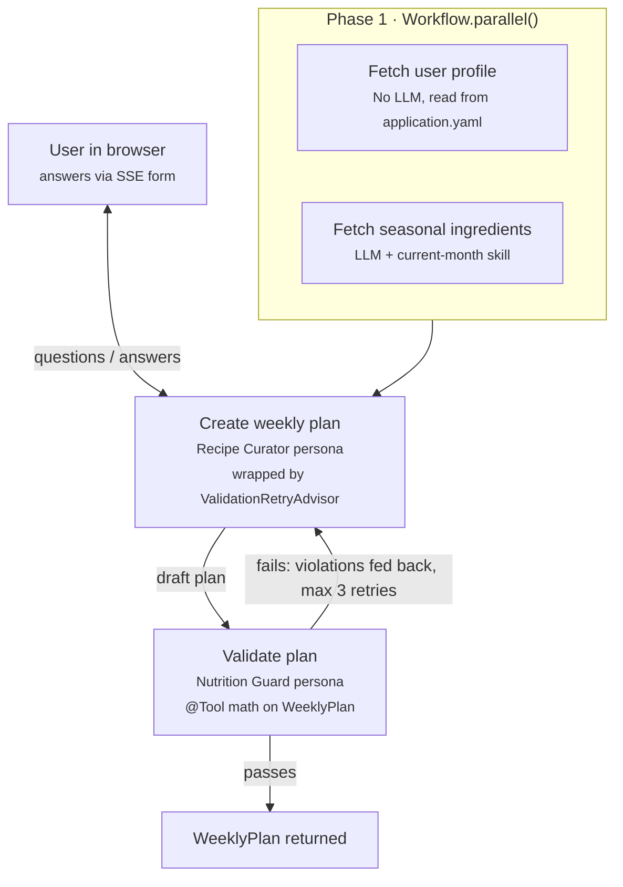
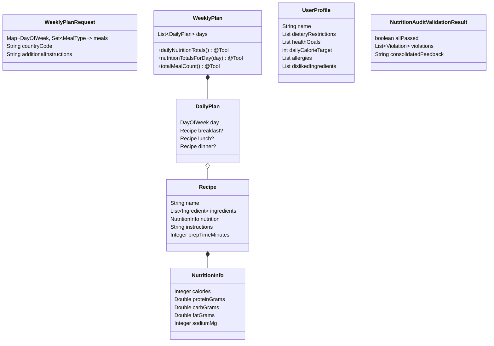
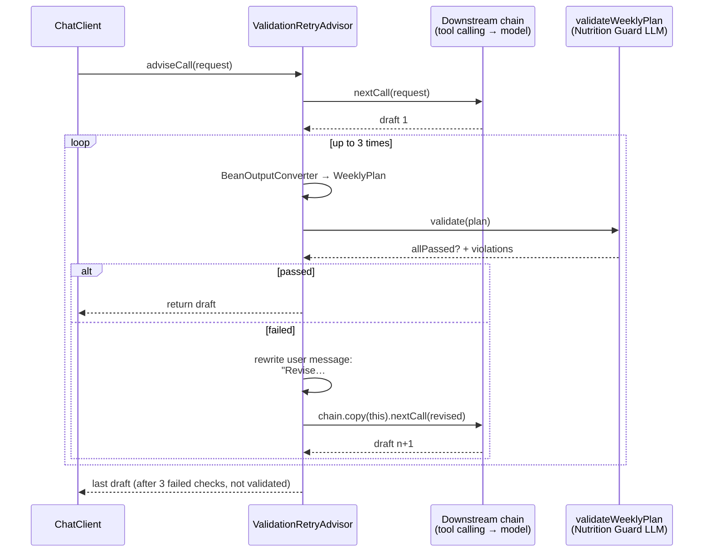
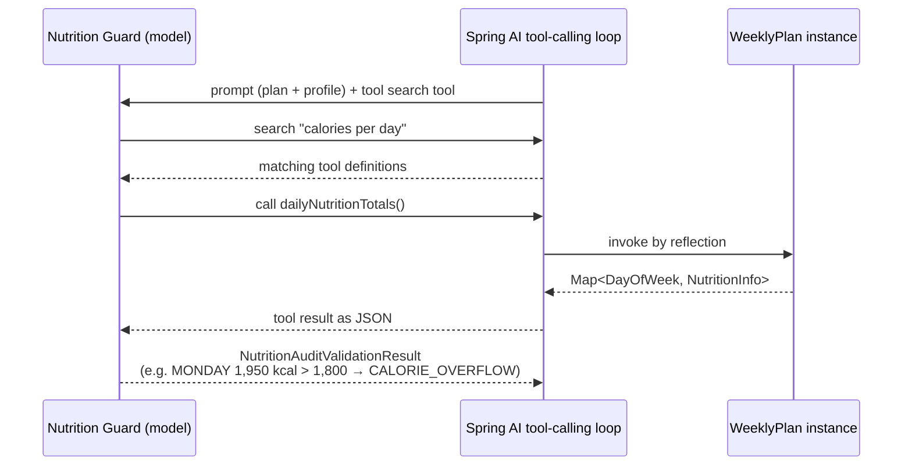
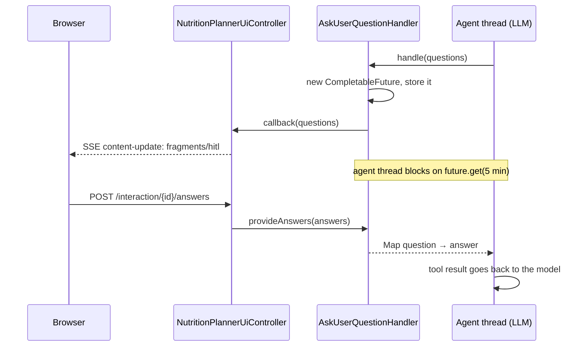
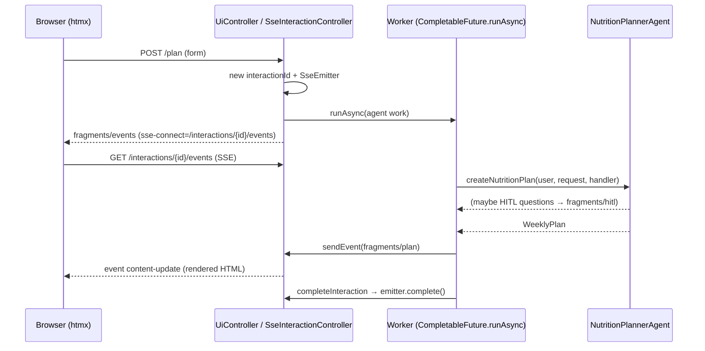

# Spring AI Nutrition Planner — How It Works

## Contents

1. [What this app is](#what-this-app-is)
2. [The talk's main ideas](#the-talks-main-ideas)
3. [Tech stack](#tech-stack)
4. [Architecture at a glance](#architecture-at-a-glance)
5. [Data model](#data-model)
6. [Phase 1: parallel inputs](#phase-1-parallel-inputs)
7. [Phase 2: create and validate](#phase-2-create-and-validate)
8. [Tools and tool search](#tools-and-tool-search)
9. [Human in the loop](#human-in-the-loop)
10. [MCP server](#mcp-server)
11. [Web UI and request flow](#web-ui-and-request-flow)
12. [Security](#security)
13. [Configuration and LLM providers](#configuration-and-llm-providers)
14. [Observability](#observability)
15. [Tests](#tests)
16. [Things worth noticing](#things-worth-noticing)

## What this app is

The app builds a weekly meal plan that fits a user's diet. It is the demo for Timo Salm's talk "Building AI Agents with Spring AI" (September 2026, see [slides.pdf](slides.pdf)). The use case is simple on purpose. The point is to show the main agentic patterns in about 170 lines of agent code.

It copies the Spring AI version from [SandraAhlgrimm/ai-nutrition-planner](https://github.com/SandraAhlgrimm/ai-nutrition-planner). That repo builds the same use case three times, with Embabel, LangChain4j and Spring AI, so you can compare the frameworks.

| Pattern | Where it lives |
| --- | --- |
| Parallel execution | `Workflow.parallel()` |
| Validation / reflection loop | `ValidationRetryAdvisor` |
| Tool use | `.tools()` on `ChatClient`, `@Tool` methods on `WeeklyPlan` |
| Tool search | `ToolSearchToolCallAdvisor`, enabled in `application.yaml` |
| Human in the loop | `AskUserQuestionTool` + `AskUserQuestionHandler` |
| Agent skills | `SkillsTool` + `resources/skills/current-month` |
| Persona | `.system(Personas.…)` on `ChatClient` |
| MCP server | `@McpTool` on `createNutritionPlan` |

## The talk's main ideas

The talk's main point is that a model needs a harness, and the talk's advice is to start with a workflow, not an autonomous agent.

1. **A model alone is not enough.** It makes up facts, has no memory, has outdated knowledge and cannot act. A harness connects it to data, memory and tools, and keeps each call secure and observable. Spring AI provides that harness.
2. **ChatClient and ChatModel.** `ChatModel` is the low-level API for each provider. `ChatClient` is the fluent API built on top of it, meant for everyday use.
3. **Advisors.** An advisor wraps each `ChatClient` call with a before step and an after step. Advisors run in order, and a context map travels with the request.
4. **Recursive advisors.** Some advisors call the model more than once for a single request, for example to retry with feedback. `chain.copy(this)` makes sure the advisors that ran earlier don't run again.
5. **Workflows vs. agents.** In a workflow your code sets the path. In an agent the model chooses it. Workflows are more predictable, cheaper and easier to test.
6. **Workflow patterns.** Chain, parallelization, routing, orchestrator-workers and evaluator-optimizer. This app uses parallelization and evaluator-optimizer.
7. **Single-agent helpers.** Agent skills, tool search, plan-and-execute and human in the loop. Tool search is GA in Spring AI 2.0. The others come from the community project `spring-ai-agent-utils`.
8. **Multi-agent patterns and protocols.** LLM as a judge, subagents, MCP (agent to tools) and A2A (agent to agent).

## Tech stack

| Part | Choice | Version (from `pom.xml`) |
| --- | --- | --- |
| Runtime | Java | 25 |
| Framework | Spring Boot | 4.1.1 |
| AI | Spring AI (`spring-ai-bom`) | 2.0.1 |
| Model starter | `spring-ai-starter-model-openai` (used for both OpenAI and Azure) | via BOM |
| Tool search | `spring-ai-starter-tool-search-advisor` | via BOM |
| MCP | `spring-ai-starter-mcp-server-webmvc` | via BOM |
| Experimental tools | `spring-ai-agent-utils` (`SkillsTool`, `ShellTools`, `AskUserQuestionTool`) | 0.11.0 |
| UI | Thymeleaf + htmx 2 (SSE extension) + Tailwind (CDN) | htmx-spring-boot 5.1.0 |
| Security | Spring Security, form login + HTTP basic | via Boot |
| Observability | Actuator, `spring-boot-starter-opentelemetry`, `grafana/otel-lgtm` via Docker Compose | via Boot |

## Architecture at a glance

The agent logic lives in `NutritionPlannerAgent.createNutritionPlan` ([NutritionPlannerAgent.java](src/main/java/com/example/nutritionplanner/NutritionPlannerAgent.java)). It is the slide 11 diagram written as plain Java.



There are two ways to start the agent, and both call the same method:

| Entry point | Caller | Question handler |
| --- | --- | --- |
| `NutritionPlannerUiController.createPlan` (`POST /plan`) | Browser | `AskUserQuestionHandler`, which pushes questions over SSE and waits for answers |
| `NutritionPlannerAgent.createNutritionPlan(WeeklyPlanRequest)` (`@McpTool`) | MCP client | `_ -> Map.of()`: every question gets no answers |

| File | Role |
| --- | --- |
| `NutritionPlannerAgent` | The workflow: phases, prompts, personas |
| `Workflow` | A small helper that runs suppliers in parallel |
| `ValidationRetryAdvisor` | Recursive advisor: validate, give feedback, retry |
| `WeeklyPlan`, `Recipe`, `NutritionInfo`, … | Records for structured output. `WeeklyPlan` also exposes `@Tool` methods |
| `NutritionPlannerUiController`, `SseInteractionController` | Web UI, SSE streaming |
| `AskUserQuestionHandler` | Bridges the agent thread and browser answers |
| `UserProfileProperties` | Loads user profiles from config |
| `NutritionPlannerConfiguration` | Security filter chain |

## Data model

All data types are Java records. Spring AI turns them into JSON Schema for structured output (`.entity(X.class)`), and the model's JSON is mapped back into them.



Notes:

- **`WeeklyPlanRequest`** has a no-arg constructor that defaults to no meals, country `DE` and empty instructions. The form binds checkboxes named `meals[MONDAY]=BREAKFAST` straight into the map.
- **`NutritionInfo`** has a second constructor that takes a `List<Recipe>` and sums each field, counting missing values as 0. This is how daily totals are computed.
- **`NutritionAuditValidationResult`** implements `ValidationRetryAdvisor.ValidationResult`. Each violation has `dayOfWeek`, `recipeName`, `explanation` and `suggestedFix`. `feedback()` returns the whole record's `toString()`, so all violations go back to the curator.
- **`SeasonalIngredients`** is just `List<String> ingredients`.

## Phase 1: parallel inputs

The profile and the seasonal ingredients don't depend on each other, so they load at the same time.

```java
var result = Workflow.parallel(() -> fetchUserProfileForUser(name), () -> fetchSeasonalIngredients(request));
var userProfile = (UserProfile) result.getFirst();
var seasonalIngredients = (SeasonalIngredients) result.getLast();
```

**`Workflow.parallel`** ([Workflow.java](src/main/java/com/example/nutritionplanner/Workflow.java))

- It creates a new fixed pool of 2 threads for each call, runs each `Supplier` with `CompletableFuture.supplyAsync`, joins them in order and shuts the pool down.
- Results come back as `List<Object>` in input order, so the caller has to cast them.
- If one task fails, `join()` throws a `CompletionException`. It surfaces in the UI as an error fragment.

**Fetch user profile.** No LLM is involved. `UserProfileProperties` (`@ConfigurationProperties(prefix = "nutrition-planner")`) finds the profile whose `name` matches the signed-in user. If no profile matches, it throws `IllegalArgumentException`. The only profile is `alice`:

```yaml
nutrition-planner:
  user-profiles:
    - name: alice
      dietary-restrictions: [vegetarian]
      health-goals: [weight-loss, improve-energy]
      daily-calorie-target: 1800
      allergies: [nuts]
      disliked-ingredients: [cilantro, olives]
```

**Fetch seasonal ingredients.** This is an LLM call that uses an **agent skill**.

1. The country code (for example `DE`) becomes an English name with `Locale.of("", code).getDisplayCountry(Locale.ENGLISH)`. In the browser, the form tries to fill in the code from geolocation using OpenStreetMap Nominatim.
2. `SkillsTool` is built from `classpath:skills`. At the start, the model only sees each skill's name and description from its `SKILL.md` front matter. It loads the full instructions only when it decides to use the skill.
3. The `current-month` skill tells the model to run `scripts/current-month.sh`, which is just `LC_ALL=C date +%B`. `ShellTools` gives the model the shell access it needs to run it. As a result, the month comes from the server's clock, not from the model's guess.
4. The prompt asks for fish, meat, fruits, vegetables and herbs at peak season in that country and month. The reply maps to `SeasonalIngredients`.

The prompt uses no persona. It only opens with "You are a nutrition expert…".

## Phase 2: create and validate

This phase is the **evaluator-optimizer** pattern from the slides. Here is how it's built.

### The generator: Recipe Curator

`createWeeklyPlan` sends:

- **System:** `Personas.RECIPE_CURATOR`, a culinary expert who uses seasonal ingredients and includes nutrition info for each recipe.
- **User:** the requested meals and days, the seasonal ingredients, and the extra instructions. It also has two rules: ask the user through a tool *if no current response is included*, and never ask about meals, diet, allergies or nutrition needs.
- **Tools:** `AskUserQuestionTool` (see [Human in the loop](#human-in-the-loop)).
- **Advisors:** `ValidationRetryAdvisor`, plus a random `CONVERSATION_ID` for tool search.

> The curator never sees the user profile. The prompt only has meals, ingredients and instructions, and the model is told not to ask about diet or allergies. So for `alice`, the first draft often breaks her diet (meat, nuts, too many calories). The validation loop is the only thing that enforces the profile. This shows off the loop well, but it costs extra LLM calls.

### The evaluator: Nutrition Guard

`validateWeeklyPlan` sends:

- **System:** `Personas.NUTRITION_GUARD`, a strict validator. It checks 5 rule types: `NUTRITION_INFO`, `CALORIE_OVERFLOW`, `ALLERGEN_PRESENT`, `RESTRICTION_VIOLATION` and `DISLIKED_INGREDIENTS_PRESENT`.
- **User:** the plan and the user profile, plus "You have to use available tools to calculate total calories…".
- **Tools:** the `WeeklyPlan` object itself (`.tools(weeklyPlan)`). Its `@Tool` methods run on that exact plan instance.
- **Output:** `NutritionAuditValidationResult`.

This is **LLM as a judge** (slide 13) with the arithmetic moved into deterministic Java.

### The loop: `ValidationRetryAdvisor`

([ValidationRetryAdvisor.java](src/main/java/com/example/nutritionplanner/ValidationRetryAdvisor.java)) This is a `CallAdvisor` with order `0`, built for one call with the response type and a validator function:

```java
new ValidationRetryAdvisor<>(WeeklyPlan.class, plan -> this.validateWeeklyPlan(plan, userProfile));
```



Details:

- **Call count.** In the worst case there are 4 curator drafts and 3 validations. The 4th draft is returned **without being checked**, and only a warning is logged.
- **`chain.copy(this)`** makes a chain of only the advisors after this one. The retry reuses tool calling and the model call, but doesn't run this advisor again.
- **Early exit.** If the response is null or still has tool calls, the advisor returns it as is and doesn't try to validate it.
- **Parsing.** It uses its own `BeanOutputConverter<WeeklyPlan>`, which reads the same JSON format that `.entity()` asked for.
- **Retry prompt.** `withValidationFeedback` uses `prompt.augmentUserMessage(m -> m.mutate().text(...))`, which *replaces* the user message text with "Revise the response based on the following feedback", the current plan and the feedback. The original meals, ingredients and instructions only carry over through the current plan. This also turns off the "ask the user" rule on retries, because a current response is now included.
- **Max retries** is fixed at `DEFAULT_MAX_RETRIES = 3`. A second constructor accepts another value, but the agent doesn't use it.

### The `@Tool` methods on `WeeklyPlan`

`WeeklyPlan` has two jobs. It is the structured output type the Recipe Curator returns, and it is the tool object the Nutrition Guard calls. The tools matter only during validation. The curator doesn't get them, and its output schema comes only from the record's fields.

| Tool | Arguments | Returns |
| --- | --- | --- |
| `dailyNutritionTotals()` | none | `Map<DayOfWeek, NutritionInfo>` in weekday order: calories, protein, carbs, fat and sodium per day |
| `nutritionTotalsForDay(DayOfWeek)` | `{"day": "MONDAY" … "SUNDAY"}` | `NutritionInfo` for one day (all zeros if that day isn't in the plan) |
| `totalMealCount()` | none | Number of non-null meals |

**How they're registered.** `validateWeeklyPlan` passes the plan itself: `.tools(weeklyPlan)`. Spring AI scans the object for `@Tool` methods and binds each one to **that instance**. The model never sends the plan as an argument, because the tool already has it through `this`. Each retry validates a new draft in a new `ChatClient` call, so the tools always compute from the current draft.

**What happens during one validation call:**



The model decides *what to check*, and Java does the *adding up*, because LLMs are bad at arithmetic. The log lines `WeeklyPlan:<tool> tool method finished with …` show which tools actually ran.

**Direct Java calls, not tool calls:**

- `createNutritionPlan` calls `totalMealCount()` for a log line.
- `dailyNutritionTotals()` calls `nutritionTotalsForDay()` as a normal method, so the model sees one call, not seven.
- `WeeklyPlanTests` calls the methods directly.

**Robustness** (both cases have unit tests):

- **Duplicate days.** If the model returns the same day more than once, the entries are merged: `dailyNutritionTotals()` returns one entry per distinct day, and `nutritionTotalsForDay()` sums every entry for that day. Before this fix, a duplicate day threw `IllegalStateException` from `Collectors.toMap`.
- **Missing values.** Meals that are `null`, recipes with no `nutrition`, and `null` fields inside `NutritionInfo` (for example no `sodiumMg`) count as 0. Before this fix, a `null` field caused an NPE when unboxed.

**Limits:**

- **Tool use isn't enforced.** The prompt says "You have to use available tools", but the model can skip them.
- **Exact sums of estimated numbers.** The totals add up the per-recipe values the curator *estimated*. If those are wrong, the totals are exactly right sums of wrong numbers. Missing values that count as 0 also make totals too low.
- **Missing days look like zero.** A day that isn't in the plan returns all zeros, which the model could misread as "nothing eaten".

## Tools and tool search

| Step | Tools the model can call |
| --- | --- |
| Fetch seasonal ingredients | `SkillsTool` (loads skills), `ShellTools` (runs the script) |
| Create weekly plan | `AskUserQuestionTool` |
| Validate plan | `WeeklyPlan` `@Tool` methods |

**Tool search** ([Anthropic's advanced tool use](https://www.anthropic.com/engineering/advanced-tool-use) pattern) is set up in `application.yaml`:

```yaml
spring.ai.chat.client.tool-search-advisor:
  enabled: true
  tool-index-type: lucene
  lucene.min-score-threshold: 0.4
```

With tool search on, the model doesn't get every tool definition up front. It gets one search tool, searches an index of tool names and descriptions, and only then sees the definitions that match (score ≥ 0.4). This matters more as tool lists grow. Here each step only has 1–3 tools, so it mainly shows the feature. The advisor needs a conversation ID, which is why each call sets `ChatMemory.CONVERSATION_ID` to a new random UUID.

`spring.ai.tools.observations.include-content: true` puts tool arguments and results into traces, which helps with debugging.

## Human in the loop

The curator can ask the user questions (for example cuisine or cooking time) through `AskUserQuestionTool` from `spring-ai-agent-utils`. Each question has a header, the question text and options (label + description).



- **One handler per interaction.** The controller keeps `interactionId → AskUserQuestionHandler` in a `ConcurrentHashMap` and removes the entry when the plan finishes or fails.
- **Timeout.** If nobody answers within 5 minutes, `handle` throws `RuntimeException("Timeout waiting for user response")`. The whole plan fails and the UI shows the error fragment.
- **The form** (`fragments/hitl.html`) shows one radio group per question, and every group is required. There is no free-text answer. A hidden field sends each question's text back so answers can be matched to questions.
- **Late answers.** `provideAnswers` completes the pending future only once. An answer that arrives when nothing is pending is ignored.

## MCP server

`@McpTool(description = "Provides a nutrition plan for the week")` on `createNutritionPlan(WeeklyPlanRequest)` exposes the whole workflow as an MCP tool.

```yaml
spring.ai.mcp.server:
  name: nutrition-planner
  protocol: STREAMABLE   # Streamable HTTP transport
```

- **Auth.** The MCP endpoint is behind the same security chain, so a client has to send HTTP basic credentials (`alice` / `123456`). The method reads the user name from `SecurityContextHolder` to find the profile.
- **No human.** The question handler returns an empty map, so if the curator asks something it gets no answers and continues.
- **Input schema.** The tool's arguments are the `WeeklyPlanRequest` JSON: `meals` (day → set of `BREAKFAST`/`LUNCH`/`DINNER`), `countryCode` and `additionalInstructions`.
- **Blocking.** The call blocks for the whole run (several LLM calls), so MCP clients need a long timeout.

## Web UI and request flow

The page is server-rendered. htmx handles the form post and a Server-Sent Events stream, so there's no JavaScript framework.



- **`SseInteractionController`** is an abstract base class. `eventStream(model, publisher)` creates the emitter (timeout `Long.MAX_VALUE`), starts the work on `CompletableFuture.runAsync` (the common ForkJoinPool), and returns the `fragments/events` fragment.
- **`sendEvent`** renders a Thymeleaf fragment to an HTML string with `TemplateEngine` and sends it as a `content-update` event. htmx swaps it into `#sse-content`.
- **Errors.** `.exceptionally(...)` unwraps `CompletionException`, logs it, sends `fragments/error` with the exception type and message, and closes the stream, so the page doesn't wait forever.
- **Page behavior** (`index.html`): 7 day cards with 3 meal checkboxes each and an "All/None" toggle, a country code (pre-filled from geolocation) and extra instructions. The Generate button is disabled while a stream is open and turns back on when htmx fires `sseClose` or `sseError`.
- **Result.** `fragments/plan` shows each day's meals using `fragments/recipe`: name, prep time, ingredients, instructions, and a nutrition panel.
- **Model label.** The nav bar shows the provider and model. `getAiModelName` uses reflection to read `model` (or `deploymentName`) from the chat model's default options.

## Security

`NutritionPlannerConfiguration` sets up the filter chain:

- **Login.** Form login at `/login` for the browser and HTTP basic for MCP and API clients. The single user comes from `spring.security.user` (`alice` / `123456`).
- **Everything needs auth** except `/actuator/**`.
- **CSRF is off.** That keeps htmx posts and MCP calls simple, but it's only OK for a demo.
- **Actuator** exposes all endpoints (`management.endpoints.web.exposure.include: "*"`) with no auth. Don't do this in production.
- **User name = profile key.** The signed-in user's name is how the agent picks a profile, so every user needs a matching entry under `nutrition-planner.user-profiles`.

## Configuration and LLM providers

| Profile | File | What it sets |
| --- | --- | --- |
| default | `application.yaml` | App name, demo user, MCP server, tool search, actuator, debug logging for `org.springframework.ai` and `org.springaicommunity`, user profiles. `spring.profiles.active: openai` |
| `openai` | `application-openai.yaml` | `OPENAI_API_KEY`, model `gpt-6-sol`, `reasoning-effort: none` |
| `azure` | `application-azure.yaml` | The **OpenAI** starter pointed at Azure: `endpoint = AZURE_OPENAI_ENDPOINT`, `api-key = AZURE_OPENAI_API_KEY`, `chat.model = AZURE_OPENAI_DEPLOYMENT_NAME` |
| `observability` | `application-observability.yaml` | OTLP metrics (5 s step), tracing (100% sampling), Docker Compose auto-start |

Only one model starter is on the classpath, `spring-ai-starter-model-openai`. Azure works by pointing it at the Azure endpoint, not through a separate Azure starter.

Run it:

```bash
export SPRING_PROFILES_ACTIVE=openai        # or azure
./mvnw spring-boot:run
# with Grafana:
SPRING_PROFILES_ACTIVE=openai,observability ./mvnw spring-boot:run
```

## Observability

With the `observability` profile, Spring Boot's Docker Compose support starts `grafana/otel-lgtm` from `docker-compose.yaml`. That container bundles Grafana, Loki, Tempo, Mimir and an OTLP collector.

| Endpoint | Port |
| --- | --- |
| Grafana (admin/admin) | 3000 |
| OTLP gRPC | 4317 |
| OTLP HTTP | 4318 |

The app sends OTLP metrics and traces. Spring AI adds its own spans for chat client calls, advisors, model calls and tool calls, so one trace shows the whole plan: parallel fetch, curator drafts, validator calls and tool calls. The dashboard `grafana/nutrition-planner.json` is provisioned as the home dashboard.

> **Dashboard mismatch.** Many panels query custom metrics: `agent_active`, `agent_invocations_total` and `agent_duration_milliseconds_bucket`, with labels like `createMealPlan`, `reviseMealPlan` and `validate`. Nothing in this codebase records those metrics, and they seem to come from another implementation in the shared repo. So the agent panels stay empty. The HTTP latency, JVM and trace panels work.

## Tests

`WeeklyPlanTests` has 5 plain unit tests for the `WeeklyPlan` tools: summing three meals, skipping `null` meals, one entry per day, merging duplicate days, and counting missing nutrition values as 0. They need no LLM or Spring context.

There are no tests for the agent, the advisor or the controllers. `src/test/resources/application-test.yaml` looks stale: it configures `spring.ai.azure.openai.*` (no Azure starter is on the classpath) and `nutrition-planner.max-validation-iterations` (no code reads it).

## Things worth noticing

- **It is a workflow, not an autonomous agent.** Java fixes the order of the steps. The model only has freedom inside a step, such as calling tools or asking questions. This follows the talk's advice to start with a workflow.
- **The profile is enforced only by validation.** The curator never sees it, so the first drafts often break it and the loop has to fix them.
- **The validator is an LLM judge.** Its checks for allergens, diet and dislikes are probabilistic. Only the calorie and macro sums are exact, because Java tools compute them.
- **A failed plan can still be returned.** After 3 failed checks, the 4th draft is returned without being validated, and only a warning is logged. The UI doesn't show that the plan failed validation.
- **Cost and time.** A run makes at least 3 LLM calls (ingredients, draft, validation) and up to 8 (1 + 4 drafts + 3 validations), plus tool-call round trips.
- **Threads.** The agent runs on the common ForkJoinPool and can block there for up to 5 minutes while waiting for a human. That's fine for a demo but could starve the pool under load.
- **Missing nutrition values count as 0.** This avoids crashes during validation, but totals can come out too low when the curator leaves a value out. See [The `@Tool` methods on `WeeklyPlan`](#the-tool-methods-on-weeklyplan).
- **Some parts are experimental.** `SkillsTool`, `ShellTools` and `AskUserQuestionTool` come from `spring-ai-agent-utils` 0.11.0. Tool search and `@McpTool` are part of Spring AI 2.0.
- **Profiles are config, not a database.** User profiles live in `application.yaml` under `nutrition-planner.user-profiles`. There's one demo user.
