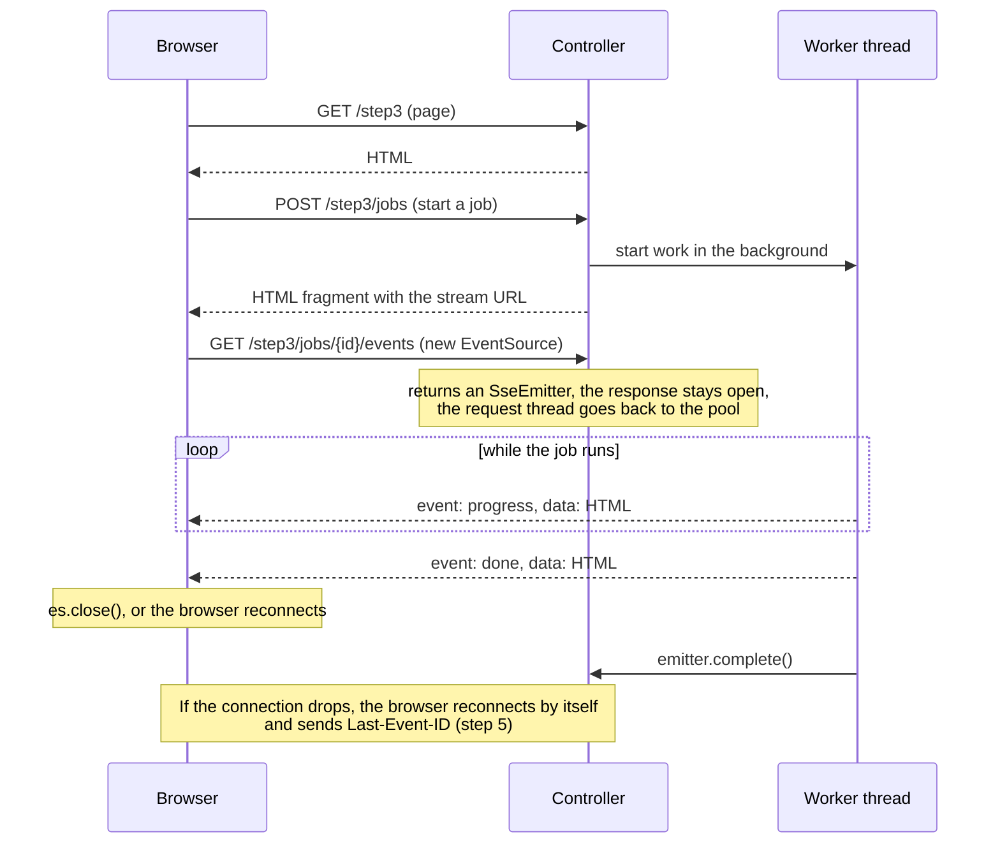

# SSE Tutorial (branch `sse-tutorial-vanilla-security`)

A step-by-step tutorial for **Server-Sent Events with Spring MVC (`SseEmitter`) and plain JavaScript (`EventSource`, `fetch`)**.

The purpose of this repo is to demo SSE with Spring MVC. It is a small Spring Boot app with one page per step, from hello world to a job that pauses to ask the user a question.

The browser side uses no framework.

## How the client and server talk

SSE is one long HTTP response that the server keeps writing to. For the other direction the browser uses ordinary requests.



- **Server → browser:** events on the stream. Any thread can send; in Spring MVC that's `emitter.send(...)`.
- **Browser → server:** a normal `fetch` POST (start a job, post a chat message, answer a question), never the stream.
- **Ending:** the server sends a final event and the page calls `es.close()`. SSE has no "end of stream" message, so without this the browser would keep reconnecting.

### Blocking or non-blocking?

Both, at different levels: **asynchronous request handling on blocking I/O.**

- **Asynchronous:** returning an `SseEmitter` starts Servlet async processing. The request thread goes back to the pool right away while the response stays open, so open streams don't hold request threads.
- **Blocking:** `emitter.send(...)` is a normal blocking write on the thread that calls it, and a slow client delays that thread. The worker threads block too, in `Thread.sleep`, database calls, or waiting for an answer.
- **Why that's fine here:** those threads are virtual threads (`spring.threads.virtual.enabled: true`, `Thread.startVirtualThread`). A blocked virtual thread costs almost nothing, so the simple blocking style scales without reactive code.
- **Fully non-blocking** would be Spring WebFlux, returning `Flux<ServerSentEvent<T>>`, with R2DBC instead of JDBC for the database.

[TUTORIAL.md](TUTORIAL.md#what-runs-on-which-thread) shows which thread sends in each step.

## Branches

Each branch is a complete, runnable version of the tutorial. They build on each other:

| Branch | Purpose |
| --- | --- |
| `sse-tutorial` | The browser side uses htmx and its SSE extension; templates are Thymeleaf. |
| `sse-tutorial-jte` | Same as `sse-tutorial`, with [jte](https://jte.gg) templates instead of Thymeleaf. |
| `sse-tutorial-vanilla` | Steps 1–6 without htmx: plain `EventSource` and `fetch`, so every line that talks to the server is visible. |
| `sse-tutorial-vanilla-security` (this branch) | `sse-tutorial-vanilla` plus Spring Security (login, USER and ADMIN roles, CSRF, a 403 page) and steps 7–8 (database pipelines with H2). |

➡️ **Start with [TUTORIAL.md](TUTORIAL.md).**

| Step | Page | Topic |
| --- | --- | --- |
| 1 | `/step1` | Hello world: wire format, `EventSource`, the reconnect gotcha |
| 2 | `/step2` | A ticking clock: long-lived streams, named events, timeouts, cleanup |
| 3 | `/step3` | Progress of a long task: POST starts a job, HTML fragments as events |
| 4 | `/step4` | A live dashboard: one stream, many named events (admin) |
| 5 | `/step5` | A chat room: broadcast, heartbeats, `Last-Event-ID` catch-up |
| 6 | `/step6` | Ask the user: two-way flow over SSE + POST (admin) |
| 7 | `/step7` | Actions that depend on each other: parallel database inserts, then processing |
| 8 | `/step8` | The pipeline for real use: job state in the database, reload-proof stream, retries, limits, cancel, timeout |

## Prerequisites

- **Java 25**
- **Maven** (wrapper included)

## Run

```bash
./mvnw spring-boot:run
```

Open [http://localhost:8080](http://localhost:8080) and log in as **alice**, **bob** or **admin** (password `password` for all). Spring Security protects every page and SSE stream; steps 4 and 6 are for **admin** only. If port 8080 is taken:

```bash
./mvnw spring-boot:run -Dspring-boot.run.arguments=--server.port=8081
```

## Test

```bash
./mvnw test
```
