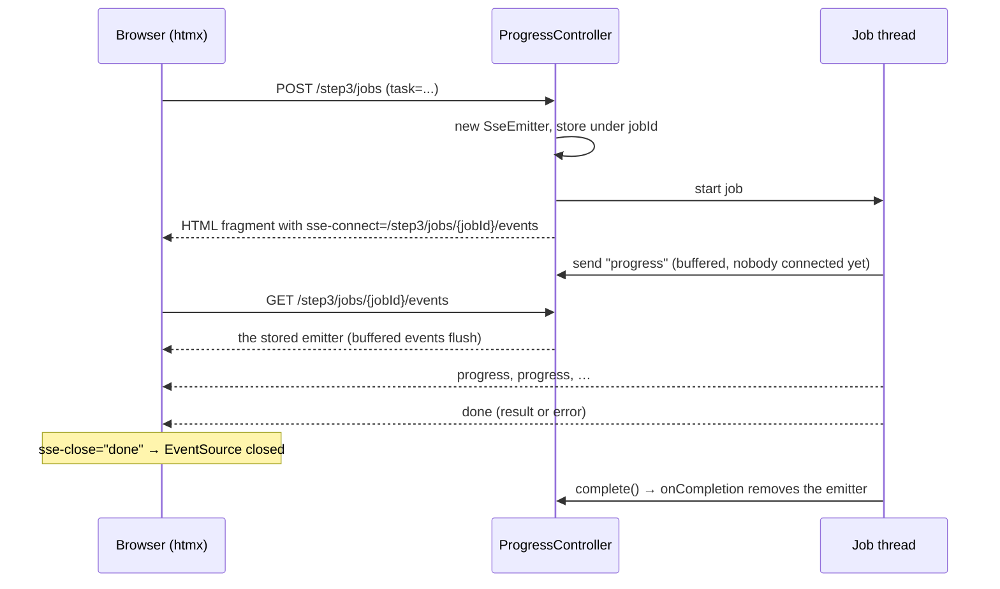
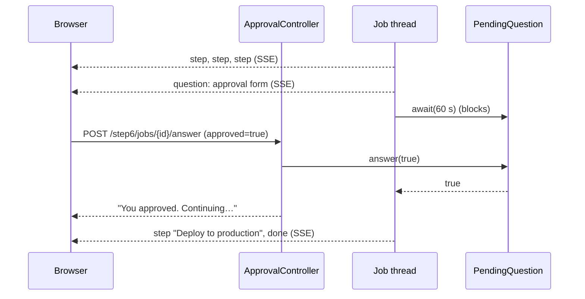

# Server-Sent Events with Spring MVC and htmx

A hands-on tutorial in six steps. Each step is a page in this app with a working example, and each one adds one idea to the one before it. By the end you'll have built an application with SSE patterns: streaming progress, HTML fragments as events, and pausing a job to ask the user a question.

| Step | Page | You learn |
| --- | --- | --- |
| 1 | [/step1](http://localhost:8080/step1) | The wire format, `SseEmitter`, plain `EventSource`, why the browser reconnects |
| 2 | [/step2](http://localhost:8080/step2) | htmx `sse-connect` / `sse-swap`, long-lived streams, timeouts, cleanup |
| 3 | [/step3](http://localhost:8080/step3) | Start a job with POST and stream its progress, HTML fragments as events, `sse-close`, errors |
| 4 | [/step4](http://localhost:8080/step4) | One stream, many named events, many targets |
| 5 | [/step5](http://localhost:8080/step5) | Broadcast to many tabs, dead-client cleanup, heartbeats, event ids, catch-up after reconnect |
| 6 | [/step6](http://localhost:8080/step6) | Two-way: pause a job, ask over SSE, continue on POST |

## Run it

```bash
./mvnw spring-boot:run          # http://localhost:8080
./mvnw spring-boot:run -Dspring-boot.run.arguments=--server.port=8081   # if 8080 is taken
./mvnw spring-boot:run -Dspring-boot.run.profiles=dev                   # edit templates without restarting
./mvnw test
```

The app needs only `spring-boot-starter-webmvc` and [jte](https://jte.gg) (`jte` + `jte-spring-boot-starter-4`). htmx 2.0.3 and its SSE extension 2.2.2 load from a CDN in `src/main/jte/layout.jte`.

### Templates: jte

Pages and the HTML sent in SSE events are jte templates in `src/main/jte`. A jte template declares its inputs as typed parameters and uses plain Java expressions:

```
@param String jobId
@param String task

<div hx-ext="sse" sse-connect="/step3/jobs/${jobId}/events" sse-close="done">
    <span>${task}</span>
</div>
```

- **Type-safe.** The `jte-maven-plugin` compiles every template to a Java class during the build. A typo or a wrong parameter type fails `./mvnw compile`, just like Java code. At runtime the app uses those precompiled classes (`gg.jte.use-precompiled-templates: true`).
- **Escaped by default.** In HTML templates, `${...}` output is escaped for where it appears: text, attribute, and so on. Step 5 relies on this.
- **One template per fragment.** Each piece of HTML that goes out as an event has its own small template, such as `step3/progress.jte` or `step6/question.jte`. Controllers return a template path as the view name (`"step3/job"`), and `FragmentRenderer` renders the same kind of path to a string.
- **Layout.** Pages call `@template.layout(title = ..., step = ..., content = @`...`)`. `layout.jte` takes a `gg.jte.Content` parameter and puts it in `<main>`.
- **Comments.** Notes in fragment templates use `<%-- --%>`. Unlike `<!-- -->`, they never reach the browser, so they don't bloat every SSE event.
- **Dev profile.** With `-Dspring-boot.run.profiles=dev`, jte compiles templates from `src/main/jte` on the fly into `jte-classes/` (gitignored). A template edit shows up on the next request, with no restart.

## SSE in one minute

SSE is a normal HTTP response that never ends quickly. The server sets `Content-Type: text/event-stream` and keeps writing small text blocks. Each block is an **event**, and a blank line ends it:

```
event:progress        ← optional name; without it the event is called "message"
id:42                 ← optional id; the browser sends back the last one when it reconnects
retry:5000            ← optional; how long the browser waits before reconnecting (ms)
data:<p>50%</p>       ← the payload (one or more data: lines)
                      ← blank line = end of event
: ping                ← a line starting with ":" is a comment, ignored by the browser
```

The browser reads it with `EventSource`, which also **reconnects automatically** when the connection drops.

| | SSE | WebSocket | Polling |
| --- | --- | --- | --- |
| Direction | Server → browser | Both ways | Browser asks |
| Protocol | Plain HTTP | Upgrade to its own protocol | Plain HTTP |
| Reconnect | Built into the browser | You write it | n/a |
| Fits | Progress, feeds, notifications, dashboards | Chat-heavy, games, collaborative editing | Rare updates |

For browser → server, SSE apps just use ordinary requests (forms, `hx-post`). Step 6 shows that this is enough even for a back-and-forth conversation.

In Spring MVC, a controller method returns an `SseEmitter`. Spring keeps the response open, and any thread can call `emitter.send(...)` until someone calls `emitter.complete()`.

---

## Step 1: Hello world

**Goal:** see the raw protocol and the one behavior that surprises everyone.

**Server** ([HelloController.java](src/main/java/com/example/sse/step1/HelloController.java)):

```java
@GetMapping(path = "/step1/stream", produces = MediaType.TEXT_EVENT_STREAM_VALUE)
SseEmitter stream() throws IOException {
    var emitter = new SseEmitter();
    emitter.send("Hello, world #" + connection);                  // data:Hello, world #1
    emitter.send(SseEmitter.event().name("close").data("bye"));   // event:close + data:bye
    emitter.complete();
    return emitter;
}
```

- `send(Object)` writes an unnamed event. `SseEmitter.event()` builds a full event with `name`, `id`, `reconnectTime` (`retry:`), `comment` and `data`.
- Sending **before** returning the emitter is fine. The emitter buffers until Spring MVC has set up the response.

**Client** ([step1.jte](src/main/jte/step1.jte)): plain JavaScript.

```js
const es = new EventSource('/step1/stream');
es.onmessage = e => log(e.data);                             // unnamed events
es.addEventListener('close', () => es.close());              // named events need addEventListener
```

**Wire format** (`curl -N http://localhost:8080/step1/stream`):

```
data:Hello, world #1

event:close
data:bye

```

**The gotcha:** click "Connect (naive)". The number keeps going up, because **SSE has no end-of-stream signal**. When the server completes the response, `EventSource` treats it as a dropped connection and reconnects after about 3 s, forever. The fix is a convention between client and server: the server sends a final event (here `close`), and the client calls `es.close()`. Steps 3 and 6 do this with htmx's `sse-close`.

---

## Step 2: A ticking clock with htmx

**Goal:** a stream that stays open, and the cleanup it needs.

**Client** ([step2.jte](src/main/jte/step2.jte)): no JavaScript.

```html
<div hx-ext="sse" sse-connect="/step2/stream">
    <p sse-swap="time">--:--:--</p>
</div>
```

- `hx-ext="sse"` turns on the extension for this element and its children.
- `sse-connect` opens one `EventSource` for the element.
- `sse-swap="time"` swaps the data of each `time` event into the element (default swap: `innerHTML`).

**Server** ([ClockController.java](src/main/java/com/example/sse/step2/ClockController.java)):

```java
var emitter = new SseEmitter(Duration.ofSeconds(60).toMillis());
var running = new AtomicBoolean(true);
emitter.onTimeout(() -> log.info("timed out"));
emitter.onError(e -> log.info("error: {}", e.toString()));
emitter.onCompletion(() -> running.set(false));      // runs last in every case

Thread.startVirtualThread(() -> {
    try {
        while (running.get()) {
            emitter.send(SseEmitter.event().name("time").data(LocalTime.now().toString()));
            Thread.sleep(1000);
        }
    } catch (IOException | IllegalStateException e) {
        // the browser went away, or the emitter already completed
    }
});
return emitter;
```

**Lessons:**

- **Timeouts.** `new SseEmitter()` uses the server's async timeout, which is 30 s on Tomcat. When it expires, Spring completes the emitter and the browser reconnects. Pass a timeout on purpose: a value in ms, or `0L` for none (step 5).
- **Finding out the browser left.** Nothing tells you right away. The next `send` fails. Spring throws `AsyncRequestNotUsableException`, which is an `IOException`. Then `onError` and `onCompletion` run. That's why the loop catches `IOException` and also checks a flag set in `onCompletion`.
- **`IllegalStateException`** means you sent on an emitter that already completed, for example after a timeout. Treat it like a gone client.
- **Virtual threads.** Each open clock holds a thread that mostly sleeps. `spring.threads.virtual.enabled: true` in `application.yaml` plus `Thread.startVirtualThread` make that cheap. With platform threads you'd use a `ScheduledExecutorService` instead.

---

## Step 3: Progress of a long task

**Goal:** start a long job with a POST and stream its progress to the page.



**The two requests:**

```java
@PostMapping("/step3/jobs")
String start(@RequestParam String task, Model model) {
    var jobId = UUID.randomUUID().toString();
    var emitter = new SseEmitter(Duration.ofMinutes(5).toMillis());
    emitters.put(jobId, emitter);
    emitter.onCompletion(() -> emitters.remove(jobId));
    Thread.startVirtualThread(() -> run(jobId, task, emitter));
    model.addAttribute("jobId", jobId);
    return "step3/job";                      // renders src/main/jte/step3/job.jte
}

@GetMapping(path = "/step3/jobs/{jobId}/events", produces = MediaType.TEXT_EVENT_STREAM_VALUE)
SseEmitter events(@PathVariable String jobId) {
    var emitter = emitters.get(jobId);
    if (emitter == null) throw new ResponseStatusException(HttpStatus.NOT_FOUND);
    return emitter;
}
```

**The returned fragment** ([step3/job.jte](src/main/jte/step3/job.jte)):

```
@param String jobId
@param String task

<div hx-ext="sse" sse-connect="/step3/jobs/${jobId}/events" sse-close="done">
    <div sse-swap="progress">Waiting for the first event…</div>
    <div sse-swap="done"></div>
</div>
```

**HTML fragments as event data.** The server renders jte templates to strings with [`FragmentRenderer`](src/main/java/com/example/sse/FragmentRenderer.java), and htmx swaps them in. This is hypermedia over SSE: the server decides what the page looks like, and the client stays declarative.

```java
public String render(String template, Map<String, Object> params) {
    var output = new StringOutput();
    templateEngine.render(template + ".jte", params, output);           // gg.jte.TemplateEngine
    return output.toString().strip().replaceAll("\\s*\\R\\s*", " ");    // one line per event
}

// in the job:
emitter.send(SseEmitter.event().name("progress").data(fragments.render("step3/progress",
        Map.of("percent", 40, "message", "Step 4 of 10"))));
```

The map keys must match the template's `@param` names. A missing parameter fails at render time, so keep the two side by side.

In the SSE format a line break ends a `data:` line, so the renderer puts the HTML on one line. That keeps each event easy to read in `curl -N`.

**Lessons:**

- **Early events aren't lost.** The job starts before the browser connects. `SseEmitter` buffers sends until the GET handler returns it. Try it: `curl -d task=x …/step3/jobs`, wait 2 s, then `curl -N` the events URL. You still get step 1.
- **Every ending sends the closing event.** Success sends `done` with the result, and failure sends `done` with an error fragment. With `sse-close="done"` htmx closes the `EventSource`. Without it you'd hit step 1's reconnect loop, and the reconnect would get a 404, because `onCompletion` already removed the job.
- **Errors are content.** A failed job doesn't break the stream. It sends a friendly error fragment as its last event.
- **Replacing the fragment closes the stream.** Start a second job: htmx notices that the old `sse-connect` element left the page and closes its `EventSource`.
- **Leaks.** If nobody ever connects, the emitter sits in the map until its 5-minute timeout. Always give job emitters a timeout.

---

## Step 4: A live dashboard

**Goal:** one connection, many named events, many targets.

```html
<section hx-ext="sse" sse-connect="/step4/stream">
    <div sse-swap="cpu">…</div>
    <div sse-swap="memory">…</div>
    <p sse-swap="orders">0</p>
    <ul sse-swap="log" hx-swap="afterbegin"></ul>
</section>
```

```java
emitter.send(SseEmitter.event().name("cpu").data(gauge("CPU", cpu)));
emitter.send(SseEmitter.event().name("memory").data(gauge("Memory", memory)));
emitter.send(SseEmitter.event().name("orders").data(String.valueOf(orders)));   // plain text works too
emitter.send(SseEmitter.event().name("log").data(logLine("Order #1001 received")));
```

**Lessons:**

- **One stream, not four.** Over HTTP/1.1 a browser allows only about 6 connections per host, and every open `EventSource` uses one. One stream with named events avoids that limit. (HTTP/2 multiplexes, so the limit is much higher.)
- **`sse-swap` picks the event; `hx-swap` picks how.** Gauges replace their content (the default `innerHTML`). The activity list uses `afterbegin` to prepend, and `beforeend` would append.
- An element can listen to several names: `sse-swap="cpu,memory"`.

---

## Step 5: A chat room

**Goal:** many clients on shared state, and keeping that list healthy.

[`ChatRoom`](src/main/java/com/example/sse/step5/ChatRoom.java) is the registry:

```java
private final List<SseEmitter> emitters = new CopyOnWriteArrayList<>();

void join(SseEmitter emitter, @Nullable Long lastEventId) {
    emitter.onCompletion(() -> leave(emitter));
    emitter.onError(_ -> leave(emitter));
    emitters.add(emitter);
    messagesAfter(lastEventId == null ? 0 : lastEventId).forEach(m -> send(emitter, () -> messageEvent(m)));
    broadcast(this::presenceEvent);
}

private void broadcast(Supplier<SseEventBuilder> event) {
    for (var emitter : emitters) send(emitter, event);
}

private void send(SseEmitter emitter, Supplier<SseEventBuilder> event) {
    try {
        emitter.send(event.get());
    } catch (IOException | IllegalStateException e) {
        leave(emitter);                      // a dead tab: drop it
    }
}
```

**Lessons:**

- **The registry.** `CopyOnWriteArrayList` fits well: iterated on every broadcast, changed only on join and leave, and safe to change while iterating.
- **Two ways to leave.** `onCompletion` / `onError` for streams Spring knows are over, and a failed `send` for tabs that vanished.
- **Build one event per emitter.** `broadcast` takes a `Supplier<SseEventBuilder>`, because a builder is consumed when it's sent. Don't share one builder instance across emitters.
- **Heartbeats.** A tab that disappears is only noticed at the next `send`. Every 15 s, `@Scheduled heartbeat()` sends a comment (`: ping`). The browser ignores it, but the write finds dead tabs, and proxies don't close a connection that looks idle.
- **No timeout, on purpose.** Chat streams use `new SseEmitter(0L)` (no timeout), because the heartbeat handles cleanup.
- **Catching up after a reconnect.** Every message event has an `id`. When the connection drops, the browser reconnects to the same URL and sends a `Last-Event-ID` header with the last id it saw. The controller reads it with `@RequestHeader(name = "Last-Event-ID", required = false) Long lastEventId`, and `join` replays only the newer messages from a 50-message history. The server sends `retry:5000` first, so the browser waits 5 s. Press "Simulate a dropped connection", post from another tab within 5 s, and watch the missed message arrive.
- **Escape user input.** Anything a user types is sent to every tab. jte escapes every `${...}` in HTML templates, so `<script>` typed into the chat arrives as `&lt;script&gt;`. Using `$unsafe{text}` in `step5/message.jte` would be a stored XSS bug for everyone in the room.
- **Templates only see public types.** Precompiled templates live in their own package, so they can't use the package-private `ChatRoom.Message` record. `ChatRoom` passes its fields (`id`, `user`, `text`, `time`) as separate parameters instead.
- **One server only.** The registry lives in memory. With several app instances, each has its own list, so a message posted to instance A never reaches tabs on instance B. Real deployments add a pub/sub layer (Redis, a message broker, Postgres `LISTEN/NOTIFY`) that feeds each instance's local emitters.

---

## Step 6: Ask the user

**Goal:** a two-way conversation over a one-way channel: a human-in-the-loop flow.



[`PendingQuestion`](src/main/java/com/example/sse/step6/PendingQuestion.java) connects the two threads with a `CompletableFuture`:

```java
T await(Duration timeout) throws InterruptedException, TimeoutException {
    try {
        return answer.get(timeout.toMillis(), TimeUnit.MILLISECONDS);
    } catch (TimeoutException e) {
        if (answer.cancel(false)) throw e;   // expire, so late answers are refused
        return answer.join();                // an answer slipped in just now
    } catch (ExecutionException e) {
        throw new IllegalStateException(e.getCause());
    }
}

boolean answer(T value) {
    return answer.complete(value);           // false if already answered or expired
}
```

The question is just another HTML fragment. Its buttons post the answer with htmx:

```html
<button hx-post="/step6/jobs/${jobId}/answer" hx-vals='{"approved": true}' hx-target="#question">Approve</button>
```

**Lessons:**

- **SSE out, HTTP in.** The question goes out on the stream. The answer comes back as an ordinary POST, with the job id in the URL so the server can find the waiting job.
- **Blocking is fine on a virtual thread.** The job thread waits up to 60 s in `await`. On a virtual thread that costs almost nothing.
- **Every wait needs a timeout, and every timeout needs a decision.** Here a timeout means "don't deploy". The question is expired, so a late click answers "too late" instead of being silently lost. `cancel` and `complete` race safely, and exactly one of them wins.
- **Try all outcomes.** Approve, reject, and wait 60 s. Also close the tab mid-question: the next `send` fails, and the job stops and expires its question.

---

## Cheat sheet

### SSE fields

| Field | `SseEmitter.event()` | Meaning |
| --- | --- | --- |
| `data:` | `.data(obj)` | Payload. Strings are written as is |
| `event:` | `.name("x")` | Event name. Default is `message` |
| `id:` | `.id("42")` | Remembered by the browser and sent back as `Last-Event-ID` on reconnect |
| `retry:` | `.reconnectTime(5000)` | Reconnect delay in ms |
| `: text` | `.comment("ping")` | Ignored by the browser. Used for heartbeats |

### `SseEmitter`

| API | Notes |
| --- | --- |
| `new SseEmitter()` | Server default timeout (Tomcat: 30 s) |
| `new SseEmitter(ms)` / `new SseEmitter(0L)` | Explicit timeout / no timeout |
| `send(...)` | Any thread. Throws `IOException` when the client is gone, `IllegalStateException` after completion |
| `complete()` | Ends the response. The browser will reconnect unless it closes first |
| `completeWithError(e)` | Ends with an error dispatch |
| `onTimeout` / `onError` / `onCompletion` | Lifecycle callbacks. `onCompletion` runs last in every case, so clean up there |

### htmx SSE extension

| Attribute | Meaning |
| --- | --- |
| `hx-ext="sse"` | Turn the extension on for this element and its children |
| `sse-connect="/url"` | Open an `EventSource`. Closed when the element leaves the page |
| `sse-swap="name[,name]"` | Swap the data of these events into this element |
| `hx-swap="beforeend"` | How to swap (`innerHTML` by default) |
| `sse-close="name"` | Close the `EventSource` when this event arrives |
| `htmx:sseOpen`, `htmx:sseError`, `htmx:sseClose`, `htmx:sseMessage` | DOM events for logging and UI state |

### Production notes

- **Proxies buffer.** Nginx and some load balancers buffer responses, so events arrive in bursts or at the end. Turn it off (`proxy_buffering off;`, or send the `X-Accel-Buffering: no` header) and raise read timeouts above your heartbeat interval.
- **Connection limit.** About 6 per host over HTTP/1.1, shared across tabs. Prefer one stream per page, or HTTP/2.
- **Auth.** `EventSource` sends cookies but can't set custom headers. Session cookies work; bearer tokens in headers don't.
- **Many instances.** In-memory registries (step 5) and job maps (steps 3 and 6) only work with one instance, or with sticky sessions. Use pub/sub or shared storage to scale out.
