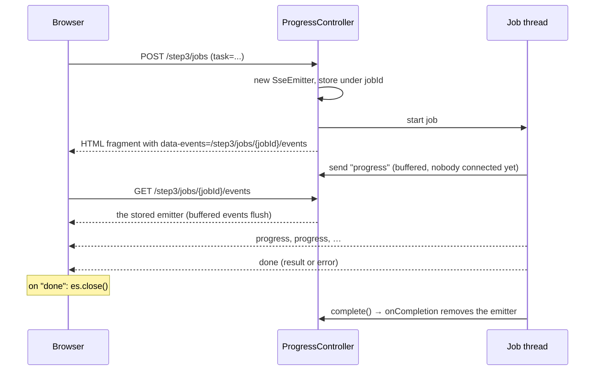
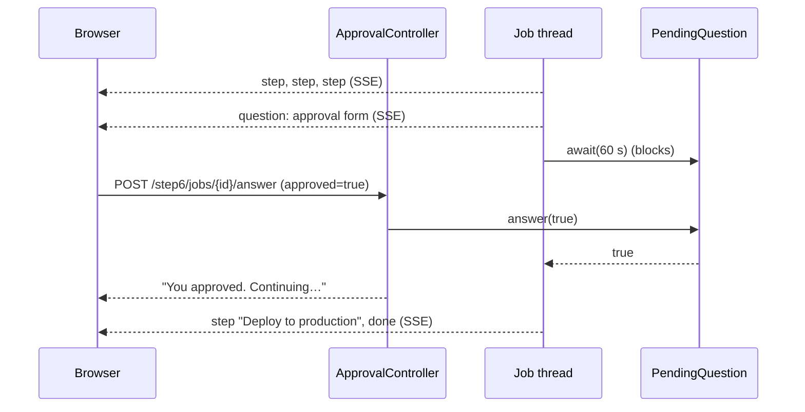

# Server-Sent Events with Spring MVC and plain JavaScript

A hands-on tutorial in six steps. Each step is a page in this app with a working example, and each one adds one idea to the one before it. By the end you'll have built an application with SSE patterns: streaming progress, HTML fragments as events, and pausing a job to ask the user a question.

The browser side uses no framework, only `EventSource` and `fetch`. Every line that talks to the server is on the page, so you can see exactly what a library like htmx would otherwise do for you. (The `sse-tutorial` branch has the same steps written with htmx.)

| Step | Page | You learn |
| --- | --- | --- |
| 1 | [/step1](http://localhost:8080/step1) | The wire format, `SseEmitter`, plain `EventSource`, why the browser reconnects |
| 2 | [/step2](http://localhost:8080/step2) | Named events and `addEventListener`, long-lived streams, timeouts, cleanup |
| 3 | [/step3](http://localhost:8080/step3) | Start a job with POST and stream its progress, HTML fragments as events, closing on `done`, errors |
| 4 | [/step4](http://localhost:8080/step4) | One stream, many named events, many targets |
| 5 | [/step5](http://localhost:8080/step5) | Broadcast to many tabs, dead-client cleanup, heartbeats, event ids, catch-up after reconnect |
| 6 | [/step6](http://localhost:8080/step6) | Two-way: pause a job, ask over SSE, continue on POST |

## Run it

```bash
./mvnw spring-boot:run          # http://localhost:8080
./mvnw spring-boot:run -Dspring-boot.run.arguments=--server.port=8081   # if 8080 is taken
./mvnw test
```

The app needs only `spring-boot-starter-webmvc` and `spring-boot-starter-thymeleaf`. The only thing loaded from a CDN is Tailwind, for styling (`templates/layout.html`). Each page's JavaScript is a small inline `<script>`.

## SSE in one minute

SSE is a normal HTTP response that never ends quickly. The server sets `Content-Type: text/event-stream` and keeps writing small text blocks. Each block is an **event**, and a blank line ends it:

```
event:progress        ← optional name; without it the event is called "message"
id:42                 ← optional id; the browser sends back the last one when it reconnects
retry:5000            ← optional; how long the browser waits before reconnecting (ms)
data:<p>50%</p>       ← the payload (one or more data: lines)
                      ← blank line = end of event
: ping                ← a line starting with ":" is a comment, ignored by the browser
```

The browser reads it with `EventSource`, which also **reconnects automatically** when the connection drops.

| | SSE | WebSocket | Polling |
| --- | --- | --- | --- |
| Direction | Server → browser | Both ways | Browser asks |
| Protocol | Plain HTTP | Upgrade to its own protocol | Plain HTTP |
| Reconnect | Built into the browser | You write it | n/a |
| Fits | Progress, feeds, notifications, dashboards | Chat-heavy, games, collaborative editing | Rare updates |

For browser → server, SSE apps just use ordinary requests (forms, `fetch`). Step 6 shows that this is enough even for a back-and-forth conversation.

In Spring MVC, a controller method returns an `SseEmitter`. Spring keeps the response open, and any thread can call `emitter.send(...)` until someone calls `emitter.complete()`.

---

## Step 1: Hello world

**Goal:** see the raw protocol and the one behavior that surprises everyone.

**Server** ([HelloController.java](src/main/java/com/example/sse/step1/HelloController.java)):

```java
@GetMapping(path = "/step1/stream", produces = MediaType.TEXT_EVENT_STREAM_VALUE)
SseEmitter stream() throws IOException {
    var emitter = new SseEmitter();
    emitter.send("Hello, world #" + connection);                  // data:Hello, world #1
    emitter.send(SseEmitter.event().name("close").data("bye"));   // event:close + data:bye
    emitter.complete();
    return emitter;
}
```

- `send(Object)` writes an unnamed event. `SseEmitter.event()` builds a full event with `name`, `id`, `reconnectTime` (`retry:`), `comment` and `data`.
- Sending **before** returning the emitter is fine. The emitter buffers until Spring MVC has set up the response.

**Client** ([step1.html](src/main/resources/templates/step1.html)): plain JavaScript.

```js
const es = new EventSource('/step1/stream');
es.onmessage = e => log(e.data);                             // unnamed events
es.addEventListener('close', () => es.close());              // named events need addEventListener
```

**Wire format** (`curl -N http://localhost:8080/step1/stream`):

```
data:Hello, world #1

event:close
data:bye

```

**The gotcha:** click "Connect (naive)". The number keeps going up, because **SSE has no end-of-stream signal**. When the server completes the response, `EventSource` treats it as a dropped connection and reconnects after about 3 s, forever. The fix is a convention between client and server: the server sends a final event (here `close`), and the client calls `es.close()`. Steps 3 and 6 do the same with a `done` event.

---

## Step 2: A ticking clock

**Goal:** a stream that stays open, and the cleanup it needs.

**Client** ([step2.html](src/main/resources/templates/step2.html)):

```html
<p id="clock">--:--:--</p>
<script>
    const es = new EventSource('/step2/stream');
    es.addEventListener('time', e => document.getElementById('clock').textContent = e.data);
</script>
```

- The server names every event `time`. Named events go only to listeners for that name, never to `onmessage`.
- `textContent` because the data is plain text. Step 3 switches to `innerHTML` when the data is HTML.
- Nothing else is needed. When the stream ends (the 60 s timeout below), `EventSource` reconnects on its own and the clock keeps going.

**Server** ([ClockController.java](src/main/java/com/example/sse/step2/ClockController.java)):

```java
var emitter = new SseEmitter(Duration.ofSeconds(60).toMillis());
var running = new AtomicBoolean(true);
emitter.onTimeout(() -> log.info("timed out"));
emitter.onError(e -> log.info("error: {}", e.toString()));
emitter.onCompletion(() -> running.set(false));      // runs last in every case

Thread.startVirtualThread(() -> {
    try {
        while (running.get()) {
            emitter.send(SseEmitter.event().name("time").data(LocalTime.now().toString()));
            Thread.sleep(1000);
        }
    } catch (IOException | IllegalStateException e) {
        // the browser went away, or the emitter already completed
    }
});
return emitter;
```

**Lessons:**

- **Timeouts.** `new SseEmitter()` uses the server's async timeout, which is 30 s on Tomcat. When it expires, Spring completes the emitter and the browser reconnects. Pass a timeout on purpose: a value in ms, or `0L` for none (step 5).
- **Finding out the browser left.** Nothing tells you right away. The next `send` fails. Spring throws `AsyncRequestNotUsableException`, which is an `IOException`. Then `onError` and `onCompletion` run. That's why the loop catches `IOException` and also checks a flag set in `onCompletion`.
- **`IllegalStateException`** means you sent on an emitter that already completed, for example after a timeout. Treat it like a gone client.
- **Virtual threads.** Each open clock holds a thread that mostly sleeps. `spring.threads.virtual.enabled: true` in `application.yaml` plus `Thread.startVirtualThread` make that cheap. With platform threads you'd use a `ScheduledExecutorService` instead.

---

## Step 3: Progress of a long task

**Goal:** start a long job with a POST and stream its progress to the page.



**The two requests:**

```java
@PostMapping("/step3/jobs")
String start(@RequestParam String task, Model model) {
    var jobId = UUID.randomUUID().toString();
    var emitter = new SseEmitter(Duration.ofMinutes(5).toMillis());
    emitters.put(jobId, emitter);
    emitter.onCompletion(() -> emitters.remove(jobId));
    Thread.startVirtualThread(() -> run(jobId, task, emitter));
    model.addAttribute("jobId", jobId);
    return "fragments/step3 :: job";
}

@GetMapping(path = "/step3/jobs/{jobId}/events", produces = MediaType.TEXT_EVENT_STREAM_VALUE)
SseEmitter events(@PathVariable String jobId) {
    var emitter = emitters.get(jobId);
    if (emitter == null) throw new ResponseStatusException(HttpStatus.NOT_FOUND);
    return emitter;
}
```

**The returned fragment** ([fragments/step3.html](src/main/resources/templates/fragments/step3.html)) says where its stream is:

```html
<div th:fragment="job" th:attr="data-events=|/step3/jobs/${jobId}/events|">
    <div data-progress>Waiting for the first event…</div>
    <div data-done></div>
</div>
```

**The page** ([step3.html](src/main/resources/templates/step3.html)) posts the form, inserts the fragment, and opens the stream:

```js
form.addEventListener('submit', async event => {
    event.preventDefault();
    const response = await fetch('/step3/jobs', {method: 'POST', body: new URLSearchParams(new FormData(form))});
    container.innerHTML = await response.text();
    const job = container.firstElementChild;

    if (es) es.close();                                   // a previous job's stream
    const stream = es = new EventSource(job.dataset.events);
    stream.addEventListener('progress', e => job.querySelector('[data-progress]').innerHTML = e.data);
    stream.addEventListener('done', e => {
        job.querySelector('[data-done]').innerHTML = e.data;
        stream.close();                                   // don't reconnect to a finished job
    });
});
```

`URLSearchParams` sends the form as `application/x-www-form-urlencoded`, which `@RequestParam` reads like a normal form post.

**HTML fragments as event data.** The server renders Thymeleaf fragments to strings with [`FragmentRenderer`](src/main/java/com/example/sse/FragmentRenderer.java), and the page puts them in with `innerHTML`. The server decides what the page looks like, and the client code stays the same whatever the fragments contain. Setting `innerHTML` is safe here only because the fragments escape every value with `th:text`. The alternative is sending JSON and building the DOM in JavaScript, which moves the templates to the browser.

```java
public String render(String template, String fragment, Map<String, Object> variables) {
    var context = new Context();
    context.setVariables(variables);
    var html = templateEngine.process(template, Set.of(fragment), context);
    return html.strip().replaceAll("\\s*\\R\\s*", " ");   // one line per event
}
```

In the SSE format a line break ends a `data:` line, so the renderer puts the HTML on one line. That keeps each event easy to read in `curl -N`.

**Lessons:**

- **Early events aren't lost.** The job starts before the browser connects. `SseEmitter` buffers sends until the GET handler returns it. Try it: `curl -d task=x …/step3/jobs`, wait 2 s, then `curl -N` the events URL. You still get step 1.
- **Every ending sends the closing event.** Success sends `done` with the result, and failure sends `done` with an error fragment. On `done` the page calls `stream.close()`. Without it you'd hit step 1's reconnect loop, and the reconnect would get a 404, because `onCompletion` already removed the job.
- **Errors are content.** A failed job doesn't break the stream. It sends a friendly error fragment as its last event.
- **Removing HTML does not close a stream.** An `EventSource` lives until you call `close()` (or the page unloads), even if the elements it updates are gone. That's why the page closes the previous job's stream before it opens the next one. Start a second job while one runs and watch the Network tab: the old request ends.
- **Leaks.** If nobody ever connects, the emitter sits in the map until its 5-minute timeout. Always give job emitters a timeout.

---

## Step 4: A live dashboard

**Goal:** one connection, many named events, many targets.

```js
const es = new EventSource('/step4/stream');
es.addEventListener('cpu', e => document.getElementById('cpu').innerHTML = e.data);
es.addEventListener('memory', e => document.getElementById('memory').innerHTML = e.data);
es.addEventListener('orders', e => document.getElementById('orders').textContent = e.data);
es.addEventListener('log', e => document.getElementById('activity').insertAdjacentHTML('afterbegin', e.data));
```

```java
emitter.send(SseEmitter.event().name("cpu").data(gauge("CPU", cpu)));
emitter.send(SseEmitter.event().name("memory").data(gauge("Memory", memory)));
emitter.send(SseEmitter.event().name("orders").data(String.valueOf(orders)));   // plain text works too
emitter.send(SseEmitter.event().name("log").data(logLine("Order #1001 received")));
```

**Lessons:**

- **One stream, not four.** Over HTTP/1.1 a browser allows only about 6 connections per host, and every open `EventSource` uses one. One stream with named events avoids that limit. (HTTP/2 multiplexes, so the limit is much higher.)
- **The event name picks the listener; the listener picks how.** Gauges replace their content with `innerHTML`. The activity list prepends with `insertAdjacentHTML('afterbegin', …)`, and `'beforeend'` would append. The plain-text `orders` count uses `textContent`.

---

## Step 5: A chat room

**Goal:** many clients on shared state, and keeping that list healthy.

[`ChatRoom`](src/main/java/com/example/sse/step5/ChatRoom.java) is the registry:

```java
private final List<SseEmitter> emitters = new CopyOnWriteArrayList<>();

void join(SseEmitter emitter, @Nullable Long lastEventId) {
    emitter.onCompletion(() -> leave(emitter));
    emitter.onError(_ -> leave(emitter));
    emitters.add(emitter);
    messagesAfter(lastEventId == null ? 0 : lastEventId).forEach(m -> send(emitter, () -> messageEvent(m)));
    broadcast(this::presenceEvent);
}

private void broadcast(Supplier<SseEventBuilder> event) {
    for (var emitter : emitters) send(emitter, event);
}

private void send(SseEmitter emitter, Supplier<SseEventBuilder> event) {
    try {
        emitter.send(event.get());
    } catch (IOException | IllegalStateException e) {
        leave(emitter);                      // a dead tab: drop it
    }
}
```

**Lessons:**

- **The registry.** `CopyOnWriteArrayList` fits well: iterated on every broadcast, changed only on join and leave, and safe to change while iterating.
- **Two ways to leave.** `onCompletion` / `onError` for streams Spring knows are over, and a failed `send` for tabs that vanished.
- **Build one event per emitter.** `broadcast` takes a `Supplier<SseEventBuilder>`, because a builder is consumed when it's sent. Don't share one builder instance across emitters.
- **Heartbeats.** A tab that disappears is only noticed at the next `send`. Every 15 s, `@Scheduled heartbeat()` sends a comment (`: ping`). The browser ignores it, but the write finds dead tabs, and proxies don't close a connection that looks idle.
- **No timeout, on purpose.** Chat streams use `new SseEmitter(0L)` (no timeout), because the heartbeat handles cleanup.
- **Client side.** One `EventSource` with listeners for `presence` and `message`. Sending is `fetch('/step5/messages', {method: 'POST', …})`, and the page doesn't add the message itself: it comes back over the stream like it does for every other tab. The server names chat events `message`, the default name, so `onmessage` would receive them too.
- **Catching up after a reconnect.** Every message event has an `id`. When the connection drops, the browser reconnects to the same URL and sends a `Last-Event-ID` header with the last id it saw. The controller reads it with `@RequestHeader(name = "Last-Event-ID", required = false) Long lastEventId`, and `join` replays only the newer messages from a 50-message history. The server sends `retry:5000` first, so the browser waits 5 s. Press "Simulate a dropped connection", post from another tab within 5 s, and watch the missed message arrive. The page contains no reconnect code: `EventSource` keeps the last id and sends the header itself.
- **Escape user input.** Anything a user types is sent to every tab. Messages are rendered with `th:text`, which escapes HTML, and the page inserts the result with `insertAdjacentHTML`. `th:utext` here would be a stored XSS bug for everyone in the room.
- **One server only.** The registry lives in memory. With several app instances, each has its own list, so a message posted to instance A never reaches tabs on instance B. Real deployments add a pub/sub layer (Redis, a message broker, Postgres `LISTEN/NOTIFY`) that feeds each instance's local emitters.

---

## Step 6: Ask the user

**Goal:** a two-way conversation over a one-way channel: a human-in-the-loop flow.



[`PendingQuestion`](src/main/java/com/example/sse/step6/PendingQuestion.java) connects the two threads with a `CompletableFuture`:

```java
T await(Duration timeout) throws InterruptedException, TimeoutException {
    try {
        return answer.get(timeout.toMillis(), TimeUnit.MILLISECONDS);
    } catch (TimeoutException e) {
        if (answer.cancel(false)) throw e;   // expire, so late answers are refused
        return answer.join();                // an answer slipped in just now
    } catch (ExecutionException e) {
        throw new IllegalStateException(e.getCause());
    }
}

boolean answer(T value) {
    return answer.complete(value);           // false if already answered or expired
}
```

The question is just another HTML fragment. Its buttons carry where to post and what to send:

```html
<button th:attr="data-answer=|/step6/jobs/${jobId}/answer|" data-approved="true">Approve</button>
```

The page has one click listener on the job container. Questions arrive later, over the stream, so the listener can't be attached to their buttons in advance:

```js
document.getElementById('job').addEventListener('click', async event => {
    const button = event.target.closest('[data-answer]');
    if (!button) return;
    const response = await fetch(button.dataset.answer, {
        method: 'POST',
        body: new URLSearchParams({approved: button.dataset.approved})
    });
    button.closest('[data-question]').innerHTML = await response.text();   // "You approved. Continuing…"
});
```

**Lessons:**

- **SSE out, HTTP in.** The question goes out on the stream. The answer comes back as an ordinary POST, with the job id in the URL so the server can find the waiting job.
- **Blocking is fine on a virtual thread.** The job thread waits up to 60 s in `await`. On a virtual thread that costs almost nothing.
- **Every wait needs a timeout, and every timeout needs a decision.** Here a timeout means "don't deploy". The question is expired, so a late click answers "too late" instead of being silently lost. `cancel` and `complete` race safely, and exactly one of them wins.
- **Try all outcomes.** Approve, reject, and wait 60 s. Also close the tab mid-question: the next `send` fails, and the job stops and expires its question.

---

## Cheat sheet

### SSE fields

| Field | `SseEmitter.event()` | Meaning |
| --- | --- | --- |
| `data:` | `.data(obj)` | Payload. Strings are written as is |
| `event:` | `.name("x")` | Event name. Default is `message` |
| `id:` | `.id("42")` | Remembered by the browser and sent back as `Last-Event-ID` on reconnect |
| `retry:` | `.reconnectTime(5000)` | Reconnect delay in ms |
| `: text` | `.comment("ping")` | Ignored by the browser. Used for heartbeats |

### `SseEmitter`

| API | Notes |
| --- | --- |
| `new SseEmitter()` | Server default timeout (Tomcat: 30 s) |
| `new SseEmitter(ms)` / `new SseEmitter(0L)` | Explicit timeout / no timeout |
| `send(...)` | Any thread. Throws `IOException` when the client is gone, `IllegalStateException` after completion |
| `complete()` | Ends the response. The browser will reconnect unless it closes first |
| `completeWithError(e)` | Ends with an error dispatch |
| `onTimeout` / `onError` / `onCompletion` | Lifecycle callbacks. `onCompletion` runs last in every case, so clean up there |

### `EventSource`

| API | Meaning |
| --- | --- |
| `new EventSource('/url')` | Open the stream (GET, cookies included). Reconnects by itself when it drops |
| `es.onmessage = e => …` | Unnamed events (and events named `message`) |
| `es.addEventListener('name', e => …)` | Named events. `e.data` is the payload, `e.lastEventId` the id |
| `es.onopen` | Connected, including after each reconnect |
| `es.onerror` | The connection failed or ended. `readyState` 0 = reconnecting, 2 = gave up |
| `es.close()` | Stop for good. The only way to stop reconnecting. Removing HTML doesn't do it |

### Putting event data into the page

| Call | Use for |
| --- | --- |
| `el.textContent = e.data` | Plain text. Never interprets markup |
| `el.innerHTML = e.data` | Replace with a server-rendered fragment |
| `el.insertAdjacentHTML('beforeend', e.data)` | Append (`'afterbegin'` to prepend) |

### Production notes

- **Proxies buffer.** Nginx and some load balancers buffer responses, so events arrive in bursts or at the end. Turn it off (`proxy_buffering off;`, or send the `X-Accel-Buffering: no` header) and raise read timeouts above your heartbeat interval.
- **Connection limit.** About 6 per host over HTTP/1.1, shared across tabs. Prefer one stream per page, or HTTP/2.
- **Auth.** `EventSource` sends cookies but can't set custom headers. Session cookies work; bearer tokens in headers don't.
- **Many instances.** In-memory registries (step 5) and job maps (steps 3 and 6) only work with one instance, or with sticky sessions. Use pub/sub or shared storage to scale out.
