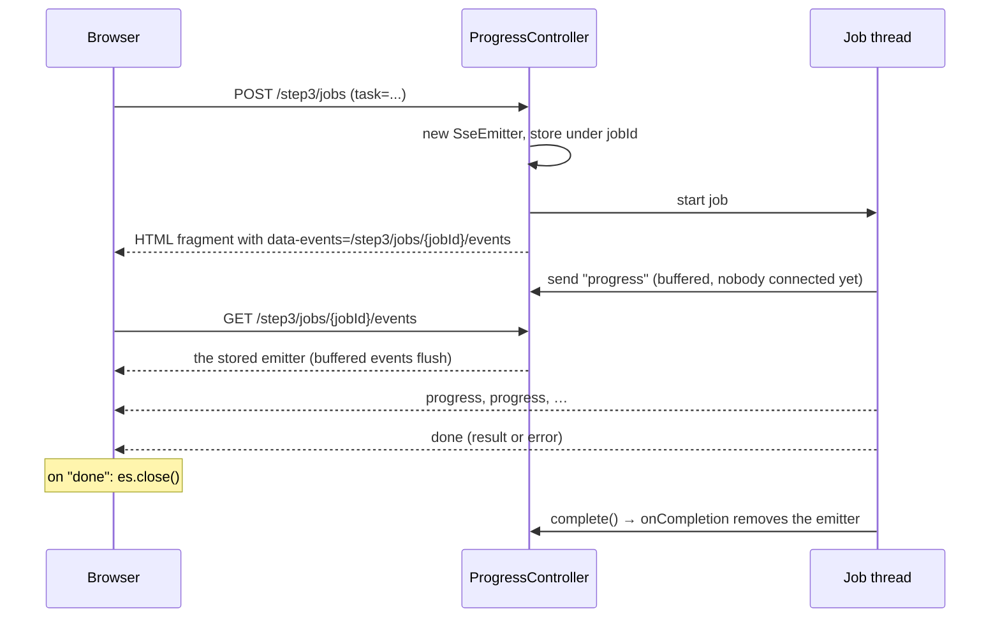
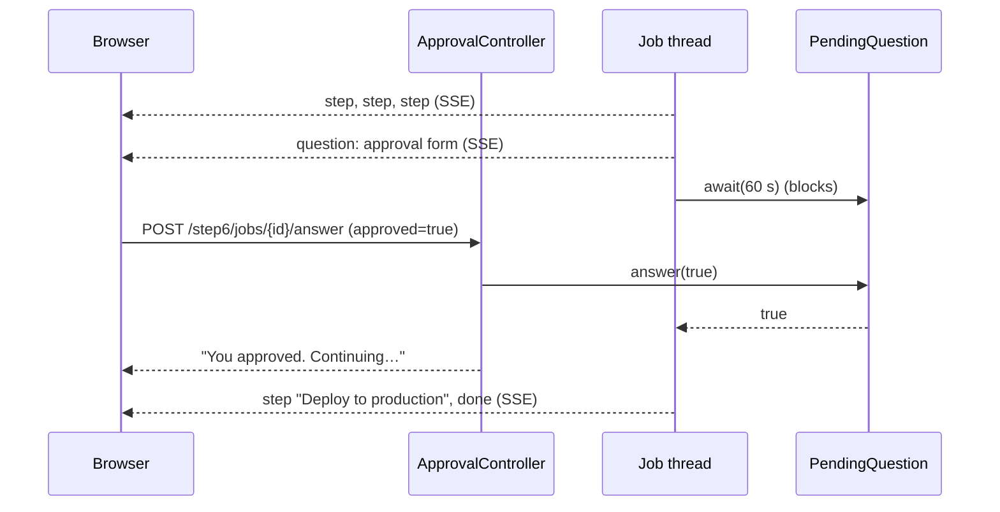
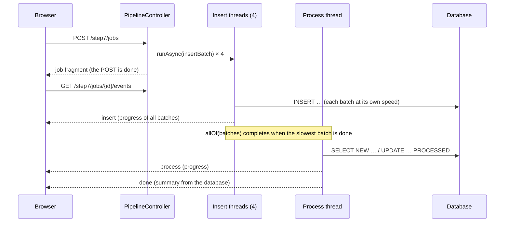

# Server-Sent Events with Spring MVC and plain JavaScript

A hands-on tutorial in eight steps. Each step is a page in this app with a working example, and each one adds one idea to the one before it. By the end you'll have built an application with SSE patterns: streaming progress, HTML fragments as events, and pausing a job to ask the user a question.

The browser side uses no framework, only `EventSource` and `fetch`. Every line that talks to the server is on the page, so you can see exactly what a library like htmx would otherwise do for you. (The `sse-tutorial` branch has the same steps written with htmx.)

| Step | Page | You learn |
| --- | --- | --- |
| 1 | [/step1](http://localhost:8080/step1) | The wire format, `SseEmitter`, plain `EventSource`, why the browser reconnects |
| 2 | [/step2](http://localhost:8080/step2) | Named events and `addEventListener`, long-lived streams, timeouts, cleanup |
| 3 | [/step3](http://localhost:8080/step3) | Start a job with POST and stream its progress, HTML fragments as events, closing on `done`, errors |
| 4 | [/step4](http://localhost:8080/step4) | One stream, many named events, many targets (admin only) |
| 5 | [/step5](http://localhost:8080/step5) | Broadcast to many tabs, dead-client cleanup, heartbeats, event ids, catch-up after reconnect |
| 6 | [/step6](http://localhost:8080/step6) | Two-way: pause a job, ask over SSE, continue on POST (admin only) |
| 7 | [/step7](http://localhost:8080/step7) | Actions that depend on each other: parallel inserts into a database, then processing, chained with `CompletableFuture` |
| 8 | [/step8](http://localhost:8080/step8) | Step 7 for real use: job state in the database, a stream that survives reloads, transactional retries, a concurrency limit, cancel, timeout, cleanup |
| | [What runs on which thread](#what-runs-on-which-thread) | Servlet async behind `SseEmitter`, who calls `send`, what "async" doesn't mean |
| | [Security](#security) | Protecting pages and streams with Spring Security, USER and ADMIN roles, CSRF for `fetch` |

## Run it

```bash
./mvnw spring-boot:run          # http://localhost:8080
./mvnw spring-boot:run -Dspring-boot.run.arguments=--server.port=8081   # if 8080 is taken
./mvnw test
```

Log in as **alice**, **bob** or **admin**, all with the password `password`. Every page and stream needs a login, and steps 4 and 6 need the ADMIN role (see [Security](#security)).

The app needs only `spring-boot-starter-webmvc`, `spring-boot-starter-thymeleaf` and `spring-boot-starter-security`, plus `spring-boot-starter-jdbc` and an in-memory H2 database for steps 7 and 8. The only thing loaded from a CDN is Tailwind, for styling (`templates/layout.html`). Each page's JavaScript is a small inline `<script>`.

## SSE in one minute

SSE is a normal HTTP response that never ends quickly. The server sets `Content-Type: text/event-stream` and keeps writing small text blocks. Each block is an **event**, and a blank line ends it:

```
event:progress        ← optional name; without it the event is called "message"
id:42                 ← optional id; the browser sends back the last one when it reconnects
retry:5000            ← optional; how long the browser waits before reconnecting (ms)
data:<p>50%</p>       ← the payload (one or more data: lines)
                      ← blank line = end of event
: ping                ← a line starting with ":" is a comment, ignored by the browser
```

The browser reads it with `EventSource`, which also **reconnects automatically** when the connection drops.

| | SSE | WebSocket | Polling |
| --- | --- | --- | --- |
| Direction | Server → browser | Both ways | Browser asks |
| Protocol | Plain HTTP | Upgrade to its own protocol | Plain HTTP |
| Reconnect | Built into the browser | You write it | n/a |
| Fits | Progress, feeds, notifications, dashboards | Chat-heavy, games, collaborative editing | Rare updates |

For browser → server, SSE apps just use ordinary requests (forms, `fetch`). Step 6 shows that this is enough even for a back-and-forth conversation.

In Spring MVC, a controller method returns an `SseEmitter`. Spring keeps the response open, and any thread can call `emitter.send(...)` until someone calls `emitter.complete()`.

---

## Step 1: Hello world

**Goal:** see the raw protocol and the one behavior that surprises everyone.

**Server** ([HelloController.java](src/main/java/com/example/sse/step1/HelloController.java)):

```java
@GetMapping(path = "/step1/stream", produces = MediaType.TEXT_EVENT_STREAM_VALUE)
SseEmitter stream() throws IOException {
    var emitter = new SseEmitter();
    emitter.send("Hello, world #" + connection);                  // data:Hello, world #1
    emitter.send(SseEmitter.event().name("close").data("bye"));   // event:close + data:bye
    emitter.complete();
    return emitter;
}
```

- `send(Object)` writes an unnamed event. `SseEmitter.event()` builds a full event with `name`, `id`, `reconnectTime` (`retry:`), `comment` and `data`.
- Sending **before** returning the emitter is fine. The emitter buffers until Spring MVC has set up the response.

**Client** ([step1.html](src/main/resources/templates/step1.html)): plain JavaScript.

```js
const es = new EventSource('/step1/stream');
es.onmessage = e => log(e.data);                             // unnamed events
es.addEventListener('close', () => es.close());              // named events need addEventListener
```

**Wire format** (`curl -N http://localhost:8080/step1/stream`):

```
data:Hello, world #1

event:close
data:bye

```

**The gotcha:** click "Connect (naive)". The number keeps going up, because **SSE has no end-of-stream signal**. When the server completes the response, `EventSource` treats it as a dropped connection and reconnects after about 3 s, forever. The fix is a convention between client and server: the server sends a final event (here `close`), and the client calls `es.close()`. Steps 3 and 6 do the same with a `done` event.

---

## Step 2: A ticking clock

**Goal:** a stream that stays open, and the cleanup it needs.

**Client** ([step2.html](src/main/resources/templates/step2.html)):

```html
<p id="clock">--:--:--</p>
<script>
    const es = new EventSource('/step2/stream');
    es.addEventListener('time', e => document.getElementById('clock').textContent = e.data);
</script>
```

- The server names every event `time`. Named events go only to listeners for that name, never to `onmessage`.
- `textContent` because the data is plain text. Step 3 switches to `innerHTML` when the data is HTML.
- Nothing else is needed. When the stream ends (the 60 s timeout below), `EventSource` reconnects on its own and the clock keeps going.

**Server** ([ClockController.java](src/main/java/com/example/sse/step2/ClockController.java)):

```java
var emitter = new SseEmitter(Duration.ofSeconds(60).toMillis());
var running = new AtomicBoolean(true);
emitter.onTimeout(() -> log.info("timed out"));
emitter.onError(e -> log.info("error: {}", e.toString()));
emitter.onCompletion(() -> running.set(false));      // runs last in every case

Thread.startVirtualThread(() -> {
    try {
        while (running.get()) {
            emitter.send(SseEmitter.event().name("time").data(LocalTime.now().toString()));
            Thread.sleep(1000);
        }
    } catch (IOException | IllegalStateException e) {
        // the browser went away, or the emitter already completed
    }
});
return emitter;
```

**Lessons:**

- **Timeouts.** `new SseEmitter()` uses the server's async timeout, which is 30 s on Tomcat. When it expires, Spring completes the emitter and the browser reconnects. Pass a timeout on purpose: a value in ms, or `0L` for none (step 5).
- **Finding out the browser left.** Nothing tells you right away. The next `send` fails. Spring throws `AsyncRequestNotUsableException`, which is an `IOException`. Then `onError` and `onCompletion` run. That's why the loop catches `IOException` and also checks a flag set in `onCompletion`.
- **`IllegalStateException`** means you sent on an emitter that already completed, for example after a timeout. Treat it like a gone client.
- **Virtual threads.** Each open clock holds a thread that mostly sleeps. `spring.threads.virtual.enabled: true` in `application.yaml` plus `Thread.startVirtualThread` make that cheap. With platform threads you'd use a `ScheduledExecutorService` instead.

---

## Step 3: Progress of a long task

**Goal:** the pattern the nutrition planner uses for `POST /plan`.



**The two requests:**

```java
@PostMapping("/step3/jobs")
String start(@RequestParam String task, Model model) {
    var jobId = UUID.randomUUID().toString();
    var emitter = new SseEmitter(Duration.ofMinutes(5).toMillis());
    emitters.put(jobId, emitter);
    emitter.onCompletion(() -> emitters.remove(jobId));
    Thread.startVirtualThread(() -> run(jobId, task, emitter));
    model.addAttribute("jobId", jobId);
    return "fragments/step3 :: job";
}

@GetMapping(path = "/step3/jobs/{jobId}/events", produces = MediaType.TEXT_EVENT_STREAM_VALUE)
SseEmitter events(@PathVariable String jobId) {
    var emitter = emitters.get(jobId);
    if (emitter == null) throw new ResponseStatusException(HttpStatus.NOT_FOUND);
    return emitter;
}
```

**The returned fragment** ([fragments/step3.html](src/main/resources/templates/fragments/step3.html)) says where its stream is:

```html
<div th:fragment="job" th:attr="data-events=|/step3/jobs/${jobId}/events|">
    <div data-progress>Waiting for the first event…</div>
    <div data-done></div>
</div>
```

**The page** ([step3.html](src/main/resources/templates/step3.html)) posts the form, inserts the fragment, and opens the stream:

```js
form.addEventListener('submit', async event => {
    event.preventDefault();
    const response = await fetch('/step3/jobs', {method: 'POST', body: new URLSearchParams(new FormData(form))});
    container.innerHTML = await response.text();
    const job = container.firstElementChild;

    if (es) es.close();                                   // a previous job's stream
    const stream = es = new EventSource(job.dataset.events);
    stream.addEventListener('progress', e => job.querySelector('[data-progress]').innerHTML = e.data);
    stream.addEventListener('done', e => {
        job.querySelector('[data-done]').innerHTML = e.data;
        stream.close();                                   // don't reconnect to a finished job
    });
});
```

`URLSearchParams` sends the form as `application/x-www-form-urlencoded`, which `@RequestParam` reads like a normal form post.

**HTML fragments as event data.** The server renders Thymeleaf fragments to strings with [`FragmentRenderer`](src/main/java/com/example/sse/FragmentRenderer.java), and the page puts them in with `innerHTML`. The server decides what the page looks like, and the client code stays the same whatever the fragments contain. Setting `innerHTML` is safe here only because the fragments escape every value with `th:text`. The alternative is sending JSON and building the DOM in JavaScript, which moves the templates to the browser.

```java
public String render(String template, String fragment, Map<String, Object> variables) {
    var context = new Context();
    context.setVariables(variables);
    var html = templateEngine.process(template, Set.of(fragment), context);
    return html.strip().replaceAll("\\s*\\R\\s*", " ");   // one line per event
}
```

In the SSE format a line break ends a `data:` line, so the renderer puts the HTML on one line. That keeps each event easy to read in `curl -N`.

**Lessons:**

- **Early events aren't lost.** The job starts before the browser connects. `SseEmitter` buffers sends until the GET handler returns it. Try it: `curl -d task=x …/step3/jobs`, wait 2 s, then `curl -N` the events URL. You still get step 1.
- **Every ending sends the closing event.** Success sends `done` with the result, and failure sends `done` with an error fragment. On `done` the page calls `stream.close()`. Without it you'd hit step 1's reconnect loop, and the reconnect would get a 404, because `onCompletion` already removed the job.
- **Errors are content.** A failed job doesn't break the stream. It sends a friendly error fragment, like the planner's `failInteraction`.
- **Removing HTML does not close a stream.** An `EventSource` lives until you call `close()` (or the page unloads), even if the elements it updates are gone. That's why the page closes the previous job's stream before it opens the next one. Start a second job while one runs and watch the Network tab: the old request ends.
- **Leaks.** If nobody ever connects, the emitter sits in the map until its 5-minute timeout. Always give job emitters a timeout.

---

## Step 4: A live dashboard

**Goal:** one connection, many named events, many targets.

```js
const es = new EventSource('/step4/stream');
es.addEventListener('cpu', e => document.getElementById('cpu').innerHTML = e.data);
es.addEventListener('memory', e => document.getElementById('memory').innerHTML = e.data);
es.addEventListener('orders', e => document.getElementById('orders').textContent = e.data);
es.addEventListener('log', e => document.getElementById('activity').insertAdjacentHTML('afterbegin', e.data));
```

```java
emitter.send(SseEmitter.event().name("cpu").data(gauge("CPU", cpu)));
emitter.send(SseEmitter.event().name("memory").data(gauge("Memory", memory)));
emitter.send(SseEmitter.event().name("orders").data(String.valueOf(orders)));   // plain text works too
emitter.send(SseEmitter.event().name("log").data(logLine("Order #1001 received")));
```

**Lessons:**

- **One stream, not four.** Over HTTP/1.1 a browser allows only about 6 connections per host, and every open `EventSource` uses one. One stream with named events avoids that limit. (HTTP/2 multiplexes, so the limit is much higher.)
- **The event name picks the listener; the listener picks how.** Gauges replace their content with `innerHTML`. The activity list prepends with `insertAdjacentHTML('afterbegin', …)`, and `'beforeend'` would append. The plain-text `orders` count uses `textContent`.

---

## Step 5: A chat room

**Goal:** many clients on shared state, and keeping that list healthy.

[`ChatRoom`](src/main/java/com/example/sse/step5/ChatRoom.java) is the registry:

```java
private final List<SseEmitter> emitters = new CopyOnWriteArrayList<>();

void join(SseEmitter emitter, @Nullable Long lastEventId) {
    emitter.onCompletion(() -> leave(emitter));
    emitter.onError(_ -> leave(emitter));
    emitters.add(emitter);
    messagesAfter(lastEventId == null ? 0 : lastEventId).forEach(m -> send(emitter, () -> messageEvent(m)));
    broadcast(this::presenceEvent);
}

private void broadcast(Supplier<SseEventBuilder> event) {
    for (var emitter : emitters) send(emitter, event);
}

private void send(SseEmitter emitter, Supplier<SseEventBuilder> event) {
    try {
        emitter.send(event.get());
    } catch (IOException | IllegalStateException e) {
        leave(emitter);                      // a dead tab: drop it
    }
}
```

**Lessons:**

- **The registry.** `CopyOnWriteArrayList` fits well: iterated on every broadcast, changed only on join and leave, and safe to change while iterating.
- **Two ways to leave.** `onCompletion` / `onError` for streams Spring knows are over, and a failed `send` for tabs that vanished.
- **Build one event per emitter.** `broadcast` takes a `Supplier<SseEventBuilder>`, because a builder is consumed when it's sent. Don't share one builder instance across emitters.
- **Heartbeats.** A tab that disappears is only noticed at the next `send`. Every 15 s, `@Scheduled heartbeat()` sends a comment (`: ping`). The browser ignores it, but the write finds dead tabs, and proxies don't close a connection that looks idle.
- **No timeout, on purpose.** Chat streams use `new SseEmitter(0L)` (no timeout), because the heartbeat handles cleanup.
- **Client side.** One `EventSource` with listeners for `presence` and `message`. Sending is `fetch('/step5/messages', {method: 'POST', …})`, and the page doesn't add the message itself: it comes back over the stream like it does for every other tab. The server names chat events `message`, the default name, so `onmessage` would receive them too.
- **Catching up after a reconnect.** Every message event has an `id`. When the connection drops, the browser reconnects to the same URL and sends a `Last-Event-ID` header with the last id it saw. The controller reads it with `@RequestHeader(name = "Last-Event-ID", required = false) Long lastEventId`, and `join` replays only the newer messages from a 50-message history. The server sends `retry:5000` first, so the browser waits 5 s. Press "Simulate a dropped connection", post from another tab within 5 s, and watch the missed message arrive. The page contains no reconnect code: `EventSource` keeps the last id and sends the header itself.
- **Escape user input.** Anything a user types is sent to every tab. Messages are rendered with `th:text`, which escapes HTML, and the page inserts the result with `insertAdjacentHTML`. `th:utext` here would be a stored XSS bug for everyone in the room.
- **One server only.** The registry lives in memory. With several app instances, each has its own list, so a message posted to instance A never reaches tabs on instance B. Real deployments add a pub/sub layer (Redis, a message broker, Postgres `LISTEN/NOTIFY`) that feeds each instance's local emitters.

---

## Step 6: Ask the user

**Goal:** a two-way conversation over a one-way channel. This is the nutrition planner's human-in-the-loop flow.



[`PendingQuestion`](src/main/java/com/example/sse/step6/PendingQuestion.java) connects the two threads with a `CompletableFuture`:

```java
T await(Duration timeout) throws InterruptedException, TimeoutException {
    try {
        return answer.get(timeout.toMillis(), TimeUnit.MILLISECONDS);
    } catch (TimeoutException e) {
        if (answer.cancel(false)) throw e;   // expire, so late answers are refused
        return answer.join();                // an answer slipped in just now
    } catch (ExecutionException e) {
        throw new IllegalStateException(e.getCause());
    }
}

boolean answer(T value) {
    return answer.complete(value);           // false if already answered or expired
}
```

The question is just another HTML fragment. Its buttons carry where to post and what to send:

```html
<button th:attr="data-answer=|/step6/jobs/${jobId}/answer|" data-approved="true">Approve</button>
```

The page has one click listener on the job container. Questions arrive later, over the stream, so the listener can't be attached to their buttons in advance:

```js
document.getElementById('job').addEventListener('click', async event => {
    const button = event.target.closest('[data-answer]');
    if (!button) return;
    const response = await fetch(button.dataset.answer, {
        method: 'POST',
        body: new URLSearchParams({approved: button.dataset.approved})
    });
    button.closest('[data-question]').innerHTML = await response.text();   // "You approved. Continuing…"
});
```

**Lessons:**

- **SSE out, HTTP in.** The question goes out on the stream. The answer comes back as an ordinary POST, with the job id in the URL so the server can find the waiting job.
- **Blocking is fine on a virtual thread.** The job thread waits up to 60 s in `await`. On a virtual thread that costs almost nothing.
- **Every wait needs a timeout, and every timeout needs a decision.** Here a timeout means "don't deploy". The question is expired, so a late click answers "too late" instead of being silently lost. `cancel` and `complete` race safely, and exactly one of them wins.
- **Try all outcomes.** Approve, reject, and wait 60 s. Also close the tab mid-question: the next `send` fails, and the job stops and expires its question.

---

## Step 7: Actions that depend on each other

**Goal:** one request, several actions, and one of them may only start when another is done.

The request starts a pipeline with two actions:

1. **Insert** 200 records into the database ([`schema.sql`](src/main/resources/schema.sql), H2 in memory). The work is split into 4 batches of 50, and each batch runs on its own virtual thread.
2. **Process** the records: compute a result for each and mark it `PROCESSED`. This must wait until **every** batch is in.



[`PipelineController`](src/main/java/com/example/sse/step7/PipelineController.java) expresses the order with `CompletableFuture`:

```java
var batches = new CompletableFuture<?>[BATCHES];
for (int batch = 0; batch < BATCHES; batch++) {
    int b = batch;   // a lambda needs an effectively final copy of the loop variable
    batches[b] = CompletableFuture.runAsync(() -> insertBatch(jobId, b, …), executor);   // action 1, in parallel
}
CompletableFuture.allOf(batches)                                   // done when every batch is done
        .thenRunAsync(() -> process(jobId, emitter), executor)     // action 2, only after that
        .whenComplete((ignored, error) -> finish(jobId, …, error, emitter));   // "done" event, success or not
```

The executor is `Executors.newVirtualThreadPerTaskExecutor()`: the threads mostly wait for the database, so virtual threads are the right fit. [`RecordRepository`](src/main/java/com/example/sse/step7/RecordRepository.java) uses `JdbcClient`, and every call borrows its own connection from the pool, so the batches really do insert at the same time.

**Lessons:**

- **`allOf` + `thenRunAsync` is the dependency.** `allOf` completes when the slowest batch finishes. `thenRunAsync` runs processing only if that happened normally. Watch the page: processing starts only when the last batch bar is full.
- **Try it without the wait.** "Don't wait" starts processing next to the inserts instead. It finds the table still empty and finishes at once with 0 records, and the summary (read from the database) shows all 200 missed. With other timings it would process some and miss the rest, which is worse: a bug that comes and goes.
- **Failures skip what depends on them.** "Make batch 3 fail" throws inside batch 3. `allOf` still waits for the other batches, then completes with the error. `thenRunAsync` skips processing, and `whenComplete` receives the error (wrapped in a `CompletionException`) and sends an error `done` event. Nothing rolls back the rows the other batches inserted. A real app would use a transaction, or clean up in `whenComplete`.
- **Every ending sends `done`.** `whenComplete` runs for success and failure alike, and completes the emitter in a `finally`. That's step 3's rule again: the browser closes on `done` and doesn't reconnect.
- **Several threads, one emitter.** Four batch threads send on the same `SseEmitter`. A single `send` is thread-safe, but "read the current progress, render it, send it" is three steps. Without the `synchronized (emitter)` block, a thread could send an older snapshot after a newer one and a bar would jump back.
- **Events carry the whole state of their part.** Each `insert` event contains the progress of all four batches, not just "batch 2 +10". The page only replaces `innerHTML`, and a missed or reordered event can't leave the display wrong for long.
- **The POST doesn't wait.** `start` only wires the futures together and returns. The request thread is free again after a few milliseconds, while the work runs for several seconds.
- **The work doesn't depend on the browser.** If the tab closes, `send` fails, the error is logged and ignored, and the pipeline still finishes its database work. Compare step 3, where the job stops when nobody is watching. Which one you want depends on the job.

---

## Step 8: The pipeline, for real

**Goal:** take step 7's pipeline to what a real application needs, and see how that changes the SSE side.

Step 7 kept everything in memory: the emitter map, the progress counters, the future chain. That's fine for one tab on one server that never restarts. Step 8 keeps the same two actions (insert in parallel batches, then process) and changes the rest. The code is in [`JobRunner`](src/main/java/com/example/sse/step8/JobRunner.java) (the work), [`JobStore`](src/main/java/com/example/sse/step8/JobStore.java) (all state, in the `jobs` and `job_batches` tables) and [`JobController`](src/main/java/com/example/sse/step8/JobController.java) (the web side).

| Concern | Step 7 | Step 8 |
| --- | --- | --- |
| Job state | Memory | `jobs` and `job_batches` tables |
| Who sends events | The worker threads | The stream reads the job's row and sends it when it changed |
| Reload, second tab, dropped connection | Lost | Same job, current state (`?job=…` in the address bar) |
| Inserts | One `INSERT` per row | `batchUpdate`, one transaction per batch |
| A batch fails | Job fails, rows stay | Rolled back and retried once. If it fails again, the job stops and deletes its rows |
| Parallel batches | All at once | At most 3 at a time, across all jobs (a `Semaphore`) |
| Cancel / timeout | None | Cancel button, 20 s deadline |
| Server restart | Jobs vanish | Unfinished jobs are marked failed at startup |
| Who can see a job | Anyone with the id | Only its owner |

**The stream is a view of the database.** This is the biggest change for SSE:

```java
while (open.get()) {
    var job = store.find(jobId, owner).orElseThrow();
    var html = render(job);
    if (job.status().finished()) {
        emitter.send(SseEmitter.event().name("done").data(html));
        emitter.complete();
        return;
    }
    if (!html.equals(sent)) {                    // only send what changed
        emitter.send(SseEmitter.event().name("state").data(html));
        sent = html;
    }
    Thread.sleep(POLL_INTERVAL);                 // 250 ms
}
```

The workers never touch an emitter; they only write to the database. So a stream can start at any time, from any tab, and on any server instance that shares the database, and it shows the truth. The page puts `?job=…` in the address bar with `history.replaceState`, so a reload reconnects to the same job. When a connection drops, the browser reconnects by itself and the first event it gets is the current state, so nothing needs `Last-Event-ID`. The price is one small query per open stream every 250 ms. At larger scale you'd replace the polling with a notification (Postgres `LISTEN/NOTIFY`, Redis pub/sub) that tells the stream when to read.

**Lessons:**

- **Transactions make retries safe.** Each batch is one transaction. If attempt 1 fails halfway, its 50 rows roll back and attempt 2 starts from a clean slate. "Batch 3 fails once" still ends with exactly 600 records, and a test checks that.
- **Progress must commit on its own.** A batch's rows stay invisible until its transaction commits, and so would its progress counter if it were written in the same transaction. So `setInserted` runs in a `REQUIRES_NEW` transaction and is visible at once.
- **So must a stop request, and a real run found that.** The timeout check often runs inside a batch's transaction. The first version wrote "stop: TIMEOUT" there. The batch then stopped, its transaction rolled back, and the stop request was rolled back with it. The job still stopped, but the reason was lost. Now `requestStop` commits in its own transaction, and `JobTimeoutTests` recreates that exact situation. Any status you write from inside a transaction that's about to fail needs its own transaction.
- **Limit what the database gets, not what one job does.** Virtual threads are free, but connections aren't: the pool has 10. A `Semaphore` with 3 permits, shared by all jobs, keeps the database from being flooded. Start jobs in two tabs and watch them take turns. The permit is taken before the transaction starts and released after it ends.
- **Stopping is cooperative.** `CompletableFuture.cancel()` and `orTimeout()` only mark the future as done, and the threads keep inserting. So cancel, the timeout and a failed batch all do the same thing: set `stop_requested` on the job. Every thread checks it between chunks and throws `JobStopped`, which rolls back its open transaction. The first reason wins, so a cancel right after a failure doesn't turn the failure into "cancelled".
- **Clean up only after everything has stopped.** `allOf` waits for every batch, even after one failed. So `finish` runs only once no thread of the job is still writing, and deleting the job's records can't race with a late insert. The job is all or nothing: finished and processed, or no records at all.
- **Jobs belong to someone.** Every query has `AND owner = ?`. Someone else's job gets the same 404 as a job that doesn't exist, so the answer doesn't reveal that the id is valid.
- **Plan for the crash.** With a database that survives restarts, a job that was running when the server died would say `INSERTING` forever. At startup, `failJobsLeftByAPreviousRun` marks such jobs failed and deletes their records. (With this tutorial's in-memory H2 there's nothing to sweep, but the code is what you'd need with Postgres.)
- **Still missing for production:** deleting old jobs after a while, a job queue so work survives a restart instead of being failed, and a pub/sub notification instead of polling.

---

## What runs on which thread

**Goal:** see what "async" means for an `SseEmitter`, now that you've seen all the patterns.

When a controller method returns an `SseEmitter`, Spring MVC handles the request with **Servlet async processing**:

1. Tomcat calls the controller method on a request thread.
2. Spring sees the `SseEmitter`, calls `request.startAsync()`, and the method returns. **The request thread goes back to the pool, but the response stays open.**
3. From then on, any thread can call `emitter.send(...)` and write to that response.
4. When the emitter ends (`complete()`, timeout or error), Spring dispatches the request once more, with dispatcher type `ASYNC`, to finish the response. That second pass goes through the filter chain again, which is why Spring Security sees it (see [Security](#security)).

The tests check step 2 with `request().asyncStarted()`.

**Who calls `send` in each step:**

| Step | Sending thread |
| --- | --- |
| 1 | The request thread itself, before returning. The emitter buffers the events until async processing has started, then flushes them. |
| 2, 4 | A virtual thread per stream (`Thread.startVirtualThread`), looping once a second |
| 3, 6 | The job's virtual thread, started by the POST. The GET only returns the stored emitter. |
| 5 | The request thread of whoever posts a message (the broadcast), and the `@Scheduled` heartbeat thread |
| 6 (answer) | The POST thread completes the `CompletableFuture`. The job thread wakes up and does the sending. |
| 7 | Four insert threads at once (one per batch), then one processing thread. The POST thread only chains the futures. |
| 8 | Nobody sends from the workers. One virtual thread per open stream reads the job's row every 250 ms and sends it when it changed. |

**What "async" doesn't mean:**

- **`send` blocks.** It's an ordinary blocking write on whichever thread calls it. This is async request processing, not non-blocking I/O. In step 5, `broadcast` writes to each tab one after another on the POST thread, so one slow client delays that POST and every tab after it in the list. At scale you'd hand each client's sends to a queue or an executor. For fully non-blocking streams, Spring WebFlux returns a `Flux<ServerSentEvent<T>>` instead.
- **Something has to keep each stream going.** In steps 2 and 4 that's one sleeping thread per open stream. A parked virtual thread costs almost nothing, which is why `application.yaml` sets `spring.threads.virtual.enabled: true` and the code uses `Thread.startVirtualThread`. One platform thread per client would not scale. Step 5 is cheaper still: no thread per client, just an emitter in a list.
- **The Servlet async timeout still applies.** Tomcat's default is 30 s. Step 1 keeps that default because its stream ends right away. Every other emitter sets its own timeout: 60 s in step 2, 5 minutes for jobs and the dashboard, `0L` (none) for the chat, whose heartbeat finds dead tabs instead.

---

## Security

**Goal:** only logged-in users see the pages or receive events, and only admins see the admin ones.

[`SecurityConfig`](src/main/java/com/example/sse/SecurityConfig.java):

```java
http
        .authorizeHttpRequests(auth -> auth
                .requestMatchers("/step4/**", "/step6/**").hasRole("ADMIN")
                .anyRequest().hasRole("USER"))
        .formLogin(Customizer.withDefaults())   // the built-in /login page
        .httpBasic(Customizer.withDefaults())   // for curl -u alice:password
        .logout(Customizer.withDefaults());
```

| User | Roles | Can use |
| --- | --- | --- |
| alice, bob | USER | Steps 1, 2, 3, 5 |
| admin | USER, ADMIN | Everything, including the system dashboard (step 4) and production deploys (step 6) |

They live in an `InMemoryUserDetailsManager` with plain-text (`{noop}`) passwords. That's fine for a tutorial, but never for a real app. Rules are checked in order and the first match wins, so the specific ADMIN rule comes before the catch-all.

**Lessons:**

- **Protect the stream, not just the page.** `/step4/**` covers the page `/step4`, its stream `/step4/stream`, and for step 6 the job POSTs and the answer POST. If only `/step4` were protected, alice could still `curl -u alice:password -N …/step4/stream` and read the dashboard. The stream URL is in the page source, so hiding the page hides nothing.
- **Hiding a link is not security.** The nav uses `sec:authorize="hasRole('ADMIN')"` so alice doesn't see links she can't use. That's only for convenience. The URL rules in `SecurityConfig` are what actually stop her.
- **A friendly 403 page.** `templates/error/403.html` is picked up by Spring Boot by its name, for every 403, and the status stays 403. It says who you are and offers "Log in as someone else" (a logout). `/error` is `permitAll()` so showing the error can never be denied itself. A stream never shows this page: `EventSource` asks for `text/event-stream`, so the 403 comes back with an empty body.
- **A forbidden stream fails for good.** For alice, `/step4/stream` answers 403. `EventSource` treats a non-200 response as fatal: it fires `onerror` with `readyState` 2 and never retries. That's different from a stream that ends normally, which step 1 showed is retried forever.
- **Streams need no special rule.** `EventSource` is a same-origin GET, so the browser sends the session cookie with it, and the stream is protected by the same login as the page. You can't add an `Authorization` header to an `EventSource`, so session cookies are the simple choice. Bearer tokens would need a cookie or a query parameter instead.
- **The async part is covered too.** `SseEmitter` finishes the request in a second, async dispatch. Spring Security sees the same authenticated session there, so nothing else needs configuring.
- **A logged-out stream ends for good.** When the session has expired, the reconnect gets a 302 to `/login`. `EventSource` follows it, receives HTML instead of `text/event-stream`, and closes (`readyState` 2). It does not keep retrying. A real app would notice that in `onerror` and send the user to the login page.
- **Logging in never lands on a stream.** Spring Security remembers the request that needed a login and returns there afterwards, but it doesn't do that for `text/event-stream` requests. So if a stream is the first protected request, you still land on `/` after logging in.
- **CSRF is on for every POST.** Forms that Thymeleaf renders with `th:action` (the logout button) get a hidden `_csrf` field automatically. `fetch` calls send the token as a header instead. `layout.html` puts it in two `<meta>` tags, and `csrfHeaders()` reads them:

  ```js
  fetch('/step3/jobs', {method: 'POST', headers: csrfHeaders(), body: new URLSearchParams(new FormData(form))});
  ```

  Without the header, the POST gets a 403. SSE itself needs no CSRF token, because the stream is a GET that changes nothing.
- **Never trust who the browser says it is.** The chat used to post a `user` form field. Now `ChatController` takes the author from `Principal`, so a user can't post as someone else. Step 5 is more fun with alice in one browser and bob in a private window.
- **curl needs credentials too.** GETs work with `-u alice:password`. POSTs also need a CSRF token and the session cookie it belongs to, so the "Try it with curl" boxes read the token from a page first.

---

## Cheat sheet

### SSE fields

| Field | `SseEmitter.event()` | Meaning |
| --- | --- | --- |
| `data:` | `.data(obj)` | Payload. Strings are written as is |
| `event:` | `.name("x")` | Event name. Default is `message` |
| `id:` | `.id("42")` | Remembered by the browser and sent back as `Last-Event-ID` on reconnect |
| `retry:` | `.reconnectTime(5000)` | Reconnect delay in ms |
| `: text` | `.comment("ping")` | Ignored by the browser. Used for heartbeats |

### `SseEmitter`

| API | Notes |
| --- | --- |
| `new SseEmitter()` | Server default timeout (Tomcat: 30 s) |
| `new SseEmitter(ms)` / `new SseEmitter(0L)` | Explicit timeout / no timeout |
| `send(...)` | Any thread. Throws `IOException` when the client is gone, `IllegalStateException` after completion |
| `complete()` | Ends the response. The browser will reconnect unless it closes first |
| `completeWithError(e)` | Ends with an error dispatch |
| `onTimeout` / `onError` / `onCompletion` | Lifecycle callbacks. `onCompletion` runs last in every case, so clean up there |

### `EventSource`

| API | Meaning |
| --- | --- |
| `new EventSource('/url')` | Open the stream (GET, cookies included). Reconnects by itself when it drops |
| `es.onmessage = e => …` | Unnamed events (and events named `message`) |
| `es.addEventListener('name', e => …)` | Named events. `e.data` is the payload, `e.lastEventId` the id |
| `es.onopen` | Connected, including after each reconnect |
| `es.onerror` | The connection failed or ended. `readyState` 0 = reconnecting, 2 = gave up |
| `es.close()` | Stop for good. The only way to stop reconnecting. Removing HTML doesn't do it |

### Putting event data into the page

| Call | Use for |
| --- | --- |
| `el.textContent = e.data` | Plain text. Never interprets markup |
| `el.innerHTML = e.data` | Replace with a server-rendered fragment |
| `el.insertAdjacentHTML('beforeend', e.data)` | Append (`'afterbegin'` to prepend) |

### Production notes

- **Proxies buffer.** Nginx and some load balancers buffer responses, so events arrive in bursts or at the end. Turn it off (`proxy_buffering off;`, or send the `X-Accel-Buffering: no` header) and raise read timeouts above your heartbeat interval.
- **Connection limit.** About 6 per host over HTTP/1.1, shared across tabs. Prefer one stream per page, or HTTP/2.
- **Auth.** `EventSource` sends cookies but can't set custom headers. Session cookies work; bearer tokens in headers don't. See [Security](#security).
- **Many instances.** In-memory registries (step 5) and job maps (steps 3 and 6) only work with one instance, or with sticky sessions. Use pub/sub or shared storage to scale out.

---

## Map to the nutrition planner

The `main` branch uses steps 3 and 6 together. It uses htmx for the browser side, so its attributes replace the JavaScript you wrote here:

| Tutorial | Nutrition planner on `main` |
| --- | --- |
| `ProgressController.start` returns a fragment with `data-events` | `NutritionPlannerUiController.createPlan` → `SseInteractionController.eventStream` → `fragments/events` |
| `emitters` map + `GET …/{id}/events` | `SseInteractionController.emitters` + `GET /interactions/{id}/events` |
| `FragmentRenderer.render` | `SseInteractionController.sendEvent` (`TemplateEngine.process`) |
| Error fragment as the last event | `failInteraction` → `fragments/error` |
| `PendingQuestion` | `AskUserQuestionHandler` (5-minute `CompletableFuture`) |
| Question fragment, answers posted with `fetch` | `fragments/hitl` → `POST /interaction/{id}/answers` → `provideAnswers` |
| `stream.close()` on `done` | Not used there: the planner calls `emitter.complete()`, and `index.html` re-enables the button on `htmx:sseClose` / `htmx:sseError` |

The last row is worth a look after step 1: without a closing event the browser tries to reconnect to a finished interaction. The planner's emitter is gone by then, so the reconnect fails, and the page reacts to the resulting `htmx:sseError`.
